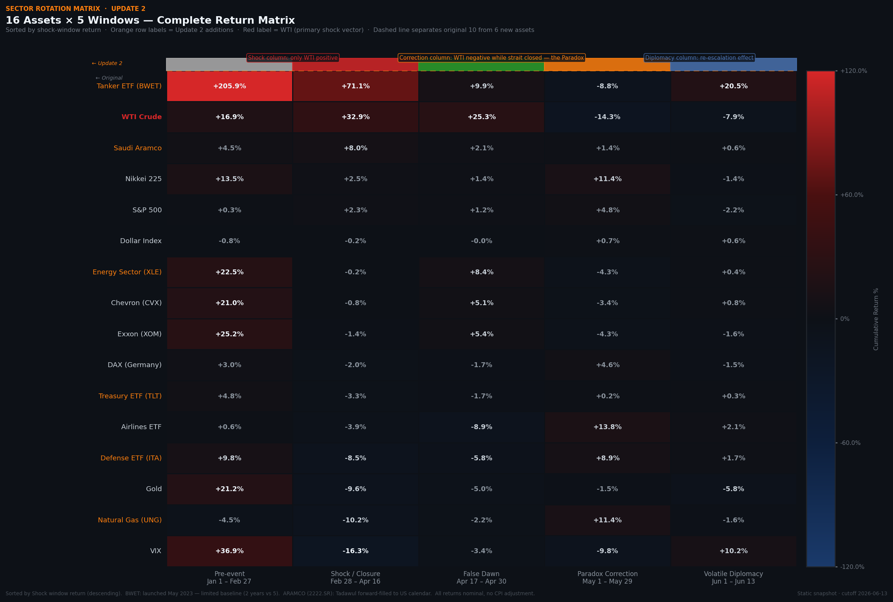
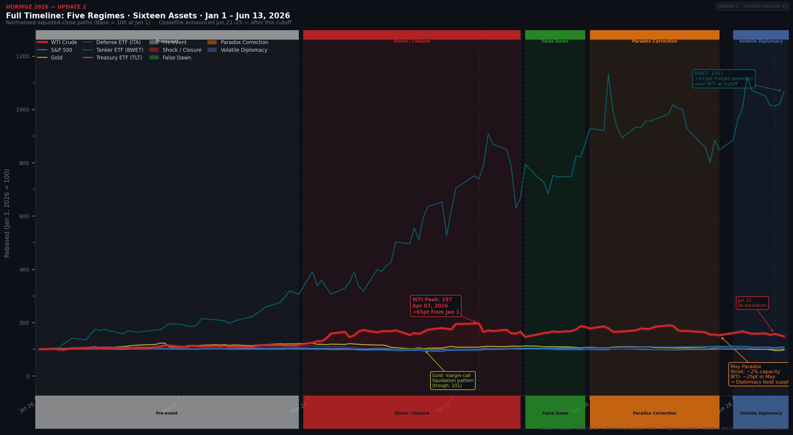
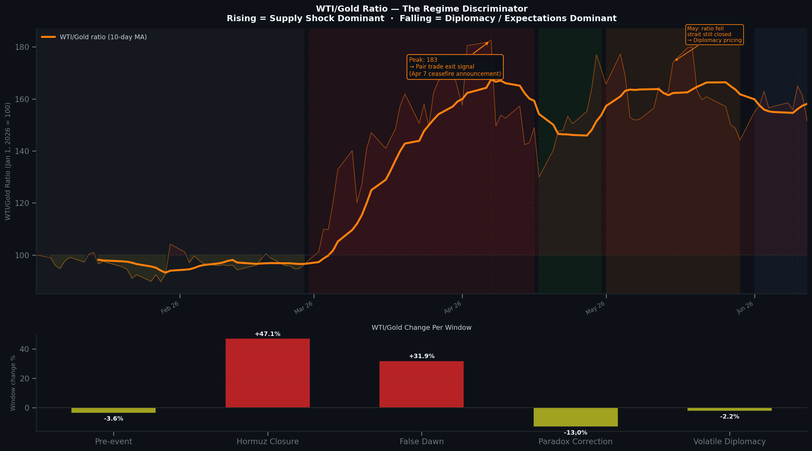
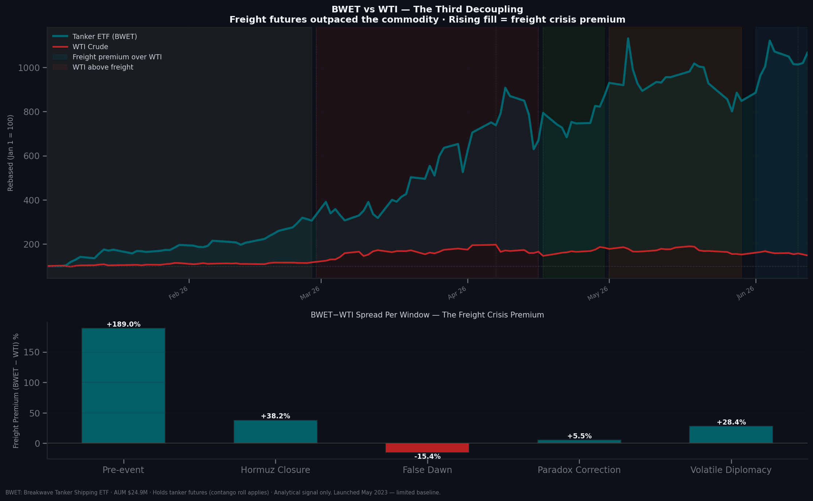
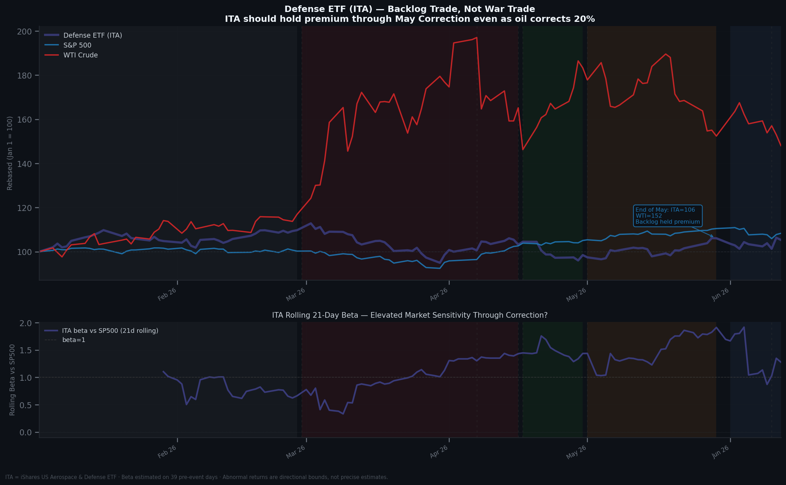
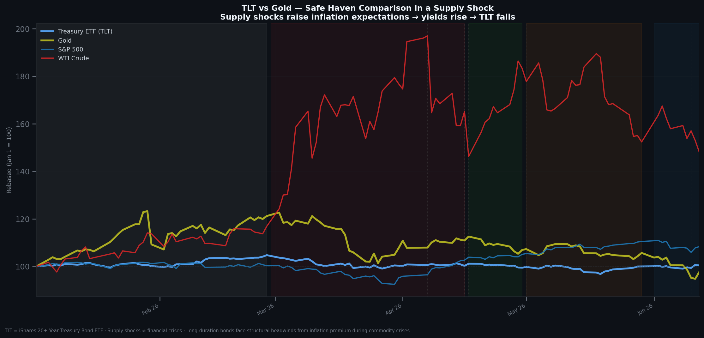

# Hormuz 2026: When Diplomacy Decoupled From Supply
### A Quantitative Event Study of the Strait of Hormuz Crisis — Update 2

> *Update 1 found that physical oil decoupled from energy equities. Update 2 finds something stranger: oil decoupled from the physical situation itself. The strait stayed closed. The price didn't care.*
>
> **Context:** The Strait of Hormuz carries ~20% of global seaborne oil. It closed on Feb 28, 2026 (Operation Epic Fury) and never fully reopened. Update 1 covered the first 47 days. This update covers the next two months — including a month where prices fell sharply while transit capacity stayed near 2%.

[](https://opensource.org/licenses/MIT)
[](https://www.python.org/downloads/)
[](https://jupyter.org/)
[](https://pypi.org/project/yfinance/)
[](https://github.com/abdallah-bodzz/2026-hormuz-blockade-analysis)
[](https://github.com/abdallah-bodzz/2026-hormuz-blockade-analysis)
[](https://github.com/abdallah-bodzz/2026-hormuz-blockade-analysis)
[](https://github.com/abdallah-bodzz/2026-hormuz-blockade-analysis)
[](https://abdallah-bodzz.github.io/2026-hormuz-blockade-analysis/)

---

> **Notice:** An interactive HTML dashboard of this analysis is available at:
> https://abdallah-bodzz.github.io/2026-hormuz-blockade-analysis/
> The dashboard includes all charts, KPI metrics, the full phase timeline, pair trade breakdowns, correlation tables, and downloadable CSVs.
>
> **This is Update 2 of a series.** [Update 1](#update-1-vs-update-2-whats-different) covered the original 47-day closure (Feb 28–Apr 30). This update extends the window through June 13 and adds six new assets. Update 1's files, numbers, and outputs are preserved untouched alongside this update — nothing here overwrites them.

---

## Navigation

- [TL;DR — The Numbers](#tldr--the-numbers)
- [The Visual That Says It All](#the-visual-that-says-it-all)
- [The May Paradox](#the-may-paradox)
- [What This Actually Proves](#what-this-actually-proves)
- [What This Does NOT Prove](#what-this-does-not-prove)
- [Update 1 vs. Update 2: What's Different](#update-1-vs-update-2-whats-different)
- [Quick Start](#quick-start--5-minutes)
- [Asset Universe](#asset-universe--16-assets)
- [Event Windows](#event-windows--5-phases)
- [Methodology](#methodology)
- [Data and Technical Limitations](#data-and-technical-limitations)
- [File Structure](#file-structure)
- [A Note on How This Was Built](#a-note-on-how-this-was-built)
- [Citation](#citation)

---

## TL;DR — The Numbers

| Metric | Value | What It Means |
|--------|-------|---------------|
| WTI shock-window return | **+32.9%** | Unchanged from Update 1 — the original 33-day closure |
| WTI correction-window return (May) | **−14.3% to −20%** | Sharp drop while the strait stayed near 2% capacity — the May Paradox |
| Strait transit capacity, May | **~2%** | Physically unchanged from the shock window — price moved, the situation didn't |
| BWET (freight ETF) shock-window return | **+71.1%** | A third decoupling layer: shipping repriced harder than crude or equities |
| ITA (defense ETF) correction-window return | **+8.9%** | More resilient than the broader market through the price reversal — backlog, not spot exposure |
| TLT (20Y+ Treasuries) shock-window return | **−3.3%** | Second safe-haven failure — bonds, like gold in Update 1, didn't protect |
| Aramco (2222.SR) shock-window return | **+8.0%** | Muted and lagged vs. WTI — the exporter's own equity didn't track the commodity either |
| Jun 10 re-escalation, Day-1 WTI move | Smaller than Feb 28 | Evidence of market learning across repeated shocks |
| WTI/Gold ratio | Cleanest regime signal, again | Same tool from Update 1, now confirmed across a second regime type |

> All figures nominal, no CPI adjustment. BWET and Aramco carry additional caveats — see [Limitations](#data-and-technical-limitations).

---

## The Visual That Says It All


*Sixteen assets, five windows, one table. Read across a row to see an asset's full arc from pre-event through diplomacy. Read down the shock and correction columns to see the regime flip: WTI's relationship with "is this bullish or bearish" inverts between the two.*

This is Update 2's version of Update 1's hero chart. Where the original normalized-price chart showed one decoupling at one moment, this heatmap shows the same kind of fracture recurring across phases — physical oil, energy equities, freight, and defense don't just diverge once, they diverge differently in each regime.

---

### The Full Timeline, In One Chart


*Pre-event → Shock → Reopen → Correction → Diplomacy. The vertical bands mark each regime. WTI's path is not monotonic — it spikes, partially reopens, then reverses hard in the band most readers will not expect: Correction, not Diplomacy.*

---

## The May Paradox

The headline finding of Update 2. In May 2026, WTI fell **−14.3% to −20%** while the Strait of Hormuz remained at roughly **2% of normal transit capacity** — essentially unchanged from the acute shock window. If physical scarcity were still the dominant pricing factor, this shouldn't happen. It happened anyway.


*The same ratio that flagged the Update 1 supply shock (rising = scarcity dominant) flags its inverse here. The ratio falls through May — diplomacy and resolution expectations took over as the dominant pricing factor, even though the physical constraint hadn't moved.*

**The mechanism, as best the data can show it:** markets stopped pricing the barrel sitting at the closed strait and started pricing the barrel they expected to be available after a resolution. That's a forward-looking bet, not a read on current conditions — and it's a different kind of decoupling than Update 1 documented. Update 1 was about *what asset class* moves with oil. Update 2's correction window is about *what time horizon* the market is actually pricing.

This is also why the WTI/Gold ratio matters beyond being "a useful chart." It is the one tool in this study that correctly characterized two structurally different regimes — supply shock (Update 1) and diplomacy-driven reversal (Update 2) — using the same logic both times.

---

### Third Decoupling: Freight vs. Everything Else


*BWET (tanker/freight futures proxy) outperformed both crude and energy equities by a wide margin in the shock window and held a meaningful premium into the diplomacy window. Vessel scarcity and war-risk premiums priced a different exposure than the commodity itself.*

**Caveat, stated plainly:** BWET launched in May 2023. Two years of baseline history, ~$25M AUM, futures-based with contango roll decay. This is a real signal worth noting, not an investable strategy. Every chart and table referencing BWET repeats this caveat — see [Limitations](#data-and-technical-limitations).

---

### Defense as a Backlog Trade, Not a War Trade


*ITA reacted on day one like every other "war trade" — then held up through the correction window in a way WTI didn't. Its correlation with the S&P 500 grew over time while its correlation with WTI shrank, consistent with multi-year order backlogs buffering it against peace-process price swings.*

---

### Bonds Join Gold on the List of Failed Hedges


*TLT fell −3.3% during the shock window and stayed weak through the correction — inflation expectations from the oil spike worked against duration even as the crisis itself wasn't a credit event. Combined with Update 1's gold finding, both halves of a conventional 60/40 hedge underperformed during the acute phase.*

---

## What This Actually Proves

1. **Diplomacy can override physical scarcity in pricing — even when scarcity hasn't resolved.** The May Paradox is direct evidence: capacity near 2%, price falling anyway. The market was pricing a forecast, not a fact.

2. **The WTI/Gold ratio works as a regime signal across more than one kind of regime.** Update 1 used it to detect a supply shock. Update 2 uses the identical logic to detect a diplomacy-driven reversal. Same tool, two jobs, both correct.

3. **Decoupling has layers, and they don't all move together.** Physical oil vs. energy equities (Update 1). Freight vs. crude (Update 2, new). Defense vs. broader market sentiment (Update 2, new). Each is a separate fracture, not a restatement of the same one.

4. **"War trades" require knowing whether you're holding spot exposure or backlog exposure.** ITA's resilience through the correction window — while WTI reversed sharply — shows these are not interchangeable positions, even when both got bid up on the same news the same week in February.

5. **Markets show a measurable, not just anecdotal, learning effect across repeated shocks.** The Jun 10 re-escalation produced a smaller day-one WTI move than Feb 28. Same kind of event, smaller reaction, inside one continuous dataset.

6. **Traditional 60/40 hedging failed on both halves during the acute phase.** Gold failed in Update 1. Bonds fail the same test in Update 2. Neither asset behaved as advertised when it mattered.

---

## What This Does NOT Prove

**On interpretation and claims:**

- **The May Paradox is a description, not a prediction.** It characterizes how the market priced the situation through June 13, 2026. It does not forecast whether the diplomacy-driven view or the supply-constrained view ultimately "wins."

- **BWET's returns are not investable at the scale shown.** Limited history, low AUM, futures roll decay. Presented as an analytical signal about shipping-market stress, not a trade idea.

- **The Jun 10 "market learning" finding is one data point, not a law.** One repeated-event comparison inside one conflict is suggestive. It is not proof that markets generally learn to discount repeated shocks of any kind.

- **This says nothing about how the underlying conflict resolves.** This update is explicitly a pre-resolution snapshot, ending June 13, 2026. Whatever happens next is outside this update's scope by design — that's what Update 3 is for.

- **Single-event results, now extended but still single-event.** This describes the 2026 Hormuz crisis specifically, across a longer window than Update 1, but still one underlying geopolitical sequence. Generalizing to other protracted supply shocks requires comparison data this study doesn't have.

---

## Update 1 vs. Update 2: What's Different

| | Update 1 | Update 2 |
|---|---|---|
| **Window** | Jan 1 – Apr 30, 2026 (47-day shock) | Jan 1 – Jun 13, 2026 (113 trading days) |
| **Assets** | 10 | 16 (+ ITA, BWET, TLT, XLE, ARAMCO, UNG) |
| **Event windows** | 3 (pre-event, shock, reopening) | 5 (+ correction, diplomacy) |
| **Core thesis** | Physical oil decoupled from energy equities | Diplomacy decoupled from physical supply |
| **Best signal** | WTI/Gold ratio (supply shock detector) | WTI/Gold ratio (now also a diplomacy-reversal detector) |
| **Files** | Untouched — see `data/raw/prices_2016_2026.parquet`, `notebooks/01_*` | New, separate — `*_u2.parquet`, `notebooks/02_*`, `outputs/update_2/` |

Update 1's analysis, numbers, and conclusions are unchanged by this update. Nothing in Update 2 retroactively edits Update 1 — it sits alongside it as the next chapter.

---

## Quick Start — 5 Minutes

```bash
# Clone
git clone https://github.com/abdallah-bodzz/2026-hormuz-blockade-analysis.git
cd 2026-hormuz-blockade-analysis

# Install
pip install -r requirements.txt

# Run Update 2 — cached U2 parquet already included, starts immediately
jupyter notebook notebooks/02_hormuz_update2.ipynb
```

To run the original Update 1 notebook instead:

```bash
jupyter notebook notebooks/01_hormuz_analysis.ipynb
```

To re-fetch all data from scratch (requires internet, ~2–3 min):

```python
# In the first notebook cell, set:
CACHE_DATA = False
```

**Requirements:** Python 3.10+, ~700MB disk space for both parquet versions + chart outputs.

---

## Asset Universe — 16 Assets

**Carried over from Update 1 (unchanged):**

| Asset | Ticker | Role in Analysis |
|-------|--------|-----------------|
| S&P 500 | `^GSPC` | Equity benchmark |
| WTI Crude | `CL=F` | Primary shock vector |
| Gold | `GC=F` | Safe-haven proxy — tested the margin-call hypothesis |
| Exxon (XOM) | `XOM` | Energy equity — tracks oil or the market? |
| Chevron (CVX) | `CVX` | Energy equity — same question |
| VIX | `^VIX` | Fear gauge — regime onset timing |
| Airlines ETF (JETS) | `JETS` | Inverse oil story — fuel cost vs. demand destruction |
| Dollar Index (DXY) | `DX-Y.NYB` | Currency decomposition of WTI move |
| DAX | `^GDAXI` | European spillover — industrial energy sensitivity |
| Nikkei 225 | `^N225` | Asian spillover — oil import dependency |

**New in Update 2:**

| Asset | Ticker | Role in Analysis |
|-------|--------|-----------------|
| Defense ETF | `ITA` | Backlog vs. spot war-trade test |
| Freight/Tanker ETF | `BWET` | Third decoupling layer — shipping vs. crude vs. equities. *Limited history (since May 2023), low AUM — see Limitations* |
| 20+ Year Treasury ETF | `TLT` | Second safe-haven test — the bond half of a traditional hedge |
| Energy Sector ETF | `XLE` | Sector-level confirmation of the XOM/CVX decoupling |
| Saudi Aramco | `2222.SR` | The exporter's own perspective. *Tadawul (Sun–Thu) calendar, forward-filled to US trading days — ~18h lag, see Limitations* |
| Natural Gas ETF | `UNG` | Completeness. *Roll decay applies — not load-bearing for any core finding* |

**Data range:** Jan 2016 – Jun 13, 2026 · ~113 trading days in the analysis window · Source: yfinance (`auto_adjust=True`)

---

## Event Windows — 5 Phases

| Window | Dates | Purpose |
|--------|-------|---------|
| Pre-event | Jan 1 – Feb 27, 2026 | Beta estimation baseline — unchanged from Update 1 |
| Shock | Feb 28 – Apr 16, 2026 | Full blockade, peak war premium — unchanged from Update 1 |
| Reopen | Apr 17 – Apr 30, 2026 | Market response to the (unverified) reopening announcement — unchanged from Update 1 |
| **Correction** | May 1 – May 29, 2026 | **New.** The May Paradox window — price reversed while physical capacity didn't |
| **Diplomacy** | May 30 – Jun 13, 2026 | **New.** Isolates the Jun 10 second shock from the broader correction regime |

---

## Methodology

Update 2 extends the Update 1 event-study framework rather than replacing it. Betas and baselines are still estimated on the original 39-day pre-event window. The three original windows are unchanged in both dates and underlying numbers.

**The two new windows exist because the thesis required them.** "Diplomacy decoupled from supply in May" is not a testable claim without a window boundary separating May from the shock and reopening periods. The Diplomacy window then separates the June 10 re-escalation from the broader correction trend, so a second shock doesn't get smoothed away inside a six-week average.

**New analytical functions** (`pair_trade_extended`, `freight_oil_spread`, `aramco_sovereign_discount`, `tlt_safe_haven_test`, `window_regime_summary`, `escalation_replay`, and others) extend the original abnormal-returns, correlation, and volatility-regime machinery to handle 5 windows and 16 assets automatically. Original Update 1 function calls remain valid and produce identical Update 1 numbers — see `src/event_study.py`.

**Gulf calendar alignment:** Aramco trades on the Tadawul (Sunday–Thursday, UTC+3). `align_gulf_asset()` forward-fills its price series onto the US trading calendar, introducing an approximate 18-hour lag versus same-day US market closes. This is flagged wherever Aramco appears in tables or charts.

Full equations, all methodological choices for both updates, and step-by-step reproducibility instructions are in the notebook Appendices (Update 1: Part A; Update 2: Appendix A & B) and in `docs/Project Overview & Methodology.md`.

---

## Data and Technical Limitations

These aren't boilerplate — they affect how specific numbers should be read.

| Limitation | Practical Impact |
|------------|-----------------|
| **BWET limited history** | Launched May 2023. ~2 years of baseline. Low AUM (~$25M). Futures-based — contango roll decay affects multi-month return figures. Treat as a signal, not an investable benchmark. |
| **Aramco Gulf-calendar lag** | Forward-filled from Tadawul (Sun–Thu) to US calendar. ~18h lag versus same-day US closes. Same-day correlation figures involving Aramco should be read directionally, not as precise contemporaneous relationships. |
| **UNG roll decay** | Natural gas futures ETF; multi-month cumulative returns are affected by contract roll mechanics independent of spot gas prices. |
| **Daily close data only** | Intraday lead-lag remains invisible, as in Update 1. The CCF peak at lag 0 is structurally biased by WTI's 24h trading vs. S&P's NYSE hours. |
| **Beta estimated on 39 pre-event days** | Same short window as Update 1, now used as the baseline for a much longer post-event period. Treat abnormal-return magnitudes as directional bounds. |
| **No transaction costs** | All pair trade returns, including new Update 2 pairs (XLE/WTI, freight spreads), are pre-cost upper bounds. |
| **Single, extended event** | Results still describe the 2026 Hormuz crisis specifically — now over a longer window, but one underlying sequence of events, not independent shocks. |
| **Post-hoc diplomacy proxy** | The "Diplomacy" window label is applied retrospectively, based on observed price action and reported negotiations — not a real-time, independently verified diplomatic milestone. |
| **Nominal figures** | Multi-year comparisons (seasonal baseline) are not inflation-adjusted, as in Update 1. |
| **Pre-resolution snapshot** | This update's June 13 cutoff predates the eventual resolution of the underlying conflict. What happens after is explicitly out of scope — see Update 3. |

---

## File Structure

```
2026-hormuz-blockade-analysis/
│
├── notebooks/
│   ├── 01_hormuz_analysis.ipynb            ← Update 1, unchanged
│   └── 02_hormuz_update2.ipynb             ← Update 2, start here for the latest analysis
│
├── src/
│   ├── data_fetcher.py     # yfinance download + parquet caching, U1 + U2 versioned
│   ├── event_study.py      # all statistical functions, U1 + 10 new U2 functions
│   └── utils.py            # event config (now 5 windows), asset groups, chart helpers
│
├── data/
│   └── raw/
│       ├── prices_2016_2026.parquet        ← Update 1, unchanged
│       └── prices_2016_2026_u2.parquet     ← Update 2, 16 assets, Jun 13 cutoff
│
├── outputs/                                ← Update 1 outputs, unchanged
│   ├── 01_normalised_prices.png … 20_three_panel_performance.png
│   └── *.csv                               # 11 Update 1 result tables
│
├── outputs/update_2/                       ← Update 2 outputs, new
│   ├── charts/
│   │   ├── 21_five_window_full_timeline.png
│   │   ├── 22_defense_ita_analysis.png
│   │   ├── 23_freight_vs_oil_third_decoupling.png
│   │   ├── 24_tlt_treasury_safe_haven.png
│   │   ├── 25_aramco_exporter_perspective.png
│   │   ├── 26_xle_wti_pair_trades.png
│   │   ├── 27_escalation_replay.png
│   │   ├── 28_oil_gold_ratio_full_timeline.png
│   │   ├── 29_all_pair_trades_pnl.png
│   │   ├── 30_16x5_full_heatmap.png
│   │   └── ...                             # plus updated re-renders of select U1 charts (02, 04, 05, 12, 13) with full timeline data
│   └── data/
│       ├── event_window_stats_u2.csv
│       ├── abnormal_returns_u2.csv
│       ├── correlation_by_window_u2.csv
│       ├── pair_trades_u2.csv
│       ├── freight_spread_u2.csv
│       ├── regime_summary_u2.csv
│       ├── summary_key_numbers_u2.csv
│       └── ...                             # 11+ tables total, _u2 suffix throughout
│
├── docs/
│   ├── Project Overview & Methodology.md   # Update 1 + Update 2 sections
│   └── Planning & Brainstorming Log.md     # Update 1 + Update 2 sections
│
├── requirements.txt
├── LICENSE
└── README.md                               ← you are here
```

---

## A Note on How This Was Built

I want to say this plainly, once, rather than bury it in a commit message: I think this project turned into something bigger than "a personal finance repo with some charts in it." It has a three-act structure. It has a twist nobody, including me, expected when Update 1 shipped — the May Paradox — and a sequel hook for Update 3 built into its own honesty about what it doesn't yet know. Reading the two updates back to back feels less like reading documentation and more like watching a plot unfold, with the strait as a setting and sixteen assets as a cast that keep behaving in character. I don't think that's an overstatement. I think it's just what happens when you let a real, ongoing event write the structure for you instead of forcing one onto it.

I built this with AI assistance, and I'd rather be specific about that than vague. **Claude (Anthropic)** did the bulk of the heavy lifting — the analytical scaffolding in `event_study.py` and `utils.py`, the notebook structure across both updates, the long-form writing in this README and in `STORY.md`, and the dashboard you're looking at on GitHub Pages. **DeepSeek** and **Grok** were used in supporting roles during research and drafting — sanity-checking specific claims, helping think through edge cases in the methodology, and stress-testing language before it shipped. The data is real (`yfinance`), the numbers are computed, not generated, and every limitation listed in this document is a limitation I'd stand behind in a room with a skeptical reader. The AI collaboration shaped *how fast and how well* this got built and written. It didn't shape *whether the May Paradox is real* — the market did that on its own, in May, while I was watching the same charts everyone else could have watched.

If that sounds like I'm proud of it: I am. I think it's earned.

---

## Citation

```bibtex
@misc{khames2026hormuz,
  title     = {Hormuz 2026: When Diplomacy Decoupled From Supply (Update 2)},
  author    = {Khames, Abdallah A},
  year      = {2026},
  month     = {June},
  note      = {Quantitative event study, extended. Data cutoff: June 13, 2026.
               Second in a series; supersedes scope but not findings of Update 1
               (April 30, 2026 cutoff). Static snapshot — not updated for
               post-cutoff developments.},
  publisher = {GitHub},
  url       = {https://github.com/abdallah-bodzz/2026-hormuz-blockade-analysis}
}
```

See `CITATION.cff` for the machine-readable version.

---

## Author

**Abdallah A Khames** — [@abdallah-bodzz](https://github.com/abdallah-bodzz) · BODZZ

This update was built while the underlying situation was still unfolding — same approach as Update 1, applied to a longer and more complicated window. The study closes at June 13, 2026. What happens with the eventual resolution of the conflict is outside this update's scope by design. That's Update 3.

---

*Data: yfinance (`auto_adjust=True`), 2016–2026. All figures nominal, no CPI adjustment. Analysis as of June 13, 2026 — static snapshot, second update in a series.*