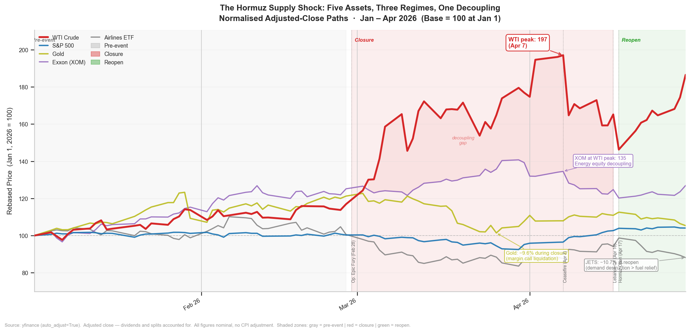
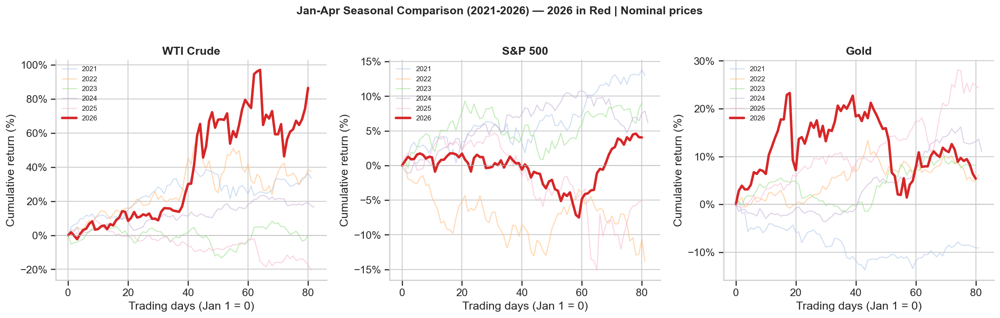
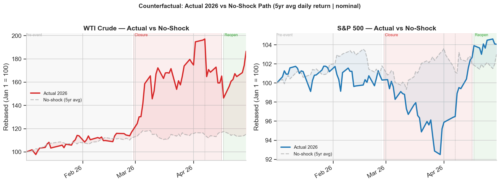
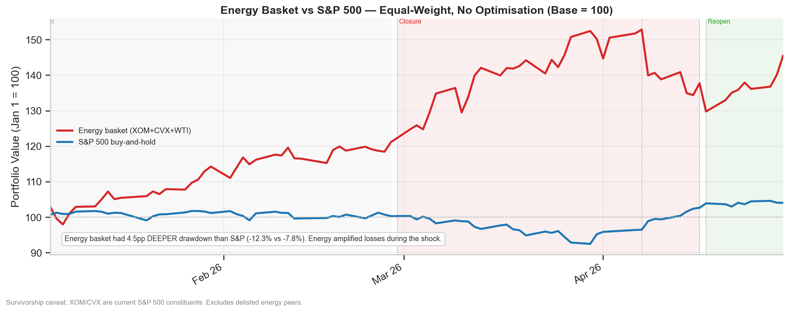

# Hormuz 2026: When Oil Decoupled from Everything
### A Quantitative Event Study of the 47-Day Strait of Hormuz Blockade

> *Physical oil decoupled. Energy stocks fell while crude rallied. Gold failed. Here's the data.*
>
> **Context:** The Strait of Hormuz carries ~20% of global seaborne oil. When Operation Epic Fury closed it on Feb 28, 2026, markets didn't react uniformly — they fractured.

[](https://opensource.org/licenses/MIT)
[](https://www.python.org/downloads/)
[](https://jupyter.org/)
[](https://pypi.org/project/yfinance/)
[](https://github.com/abdallah-bodzz/2026-hormuz-blockade-analysis)
[](https://github.com/abdallah-bodzz/2026-hormuz-blockade-analysis)
[](https://github.com/abdallah-bodzz/2026-hormuz-blockade-analysis)
[](https://github.com/abdallah-bodzz/2026-hormuz-blockade-analysis)
[](https://abdallah-bodzz.github.io/2026-hormuz-blockade-analysis/)

---

> **Notice:** An interactive HTML dashboard of this analysis is available at:
> https://abdallah-bodzz.github.io/2026-hormuz-blockade-analysis/
> The dashboard includes all charts, KPI metrics, phase timeline, pair trade breakdown, correlation tables, and downloadable CSVs.

---

## Navigation

- [TL;DR — The Numbers](#tldr-the-numbers)
- [The Visual That Says It All](#the-visual-that-says-it-all)
- [What This Actually Proves](#what-this-actually-proves)
- [What This Does NOT Prove](#what-this-does-not-prove)
- [Quick Start](#quick-start--5-minutes)
- [Asset Universe](#asset-universe)
- [Methodology](#methodology)
- [Data and Technical Limitations](#data-and-technical-limitations)
- [File Structure](#file-structure)
- [Citation](#citation)

---

## TL;DR — The Numbers

| Metric | Value | What It Means |
|--------|-------|---------------|
| WTI shock-window return | **+32.9%** | 33 trading days of closure |
| WTI abnormal return (pure Hormuz effect) | **+20.9%** | Net of beta and pre-event trend |
| WTI Jan–Apr cumulative | **+86.5%** | 6.5× the 5-year average |
| Gold shock-window return | **−9.6%** | Safe haven failed under margin pressure |
| S&P 500 max drawdown | **−7.8%** | Equity markets held |
| Energy basket (XOM+CVX+WTI) max drawdown | **−12.3%** | 4.5pp deeper than the broad market |
| Long WTI / Short XOM — shock window | **+34.4%** | The exploitable dislocation |
| WTI/Gold ratio change | **+47%** | Supply shock signal, not systemic fear |
| DXY contribution to WTI | **<1%** | Physical barrels, not dollar weakness |
| VIX peak | **31.0** | Elevated, not panic |
| Days for S&P to price the announcement¹ | **1** | Market efficiency, not complacency |

> ¹ *The Apr 17 announcement — not verified normalization. Iran re-closed the strait on Apr 18. See [What This Does NOT Prove](#what-this-does-not-prove).*

---

## The Visual That Says It All


*Five assets. Three regimes. One decoupling. WTI diverges upward, gold reverses mid-crisis, energy equities flatline while crude rallies, and airlines bleed across all three windows.*

What I think makes this chart the clearest summary of the entire study: you can see the exact moment the decoupling started (Feb 28 vertical line), watch gold and XOM fail to track oil upward, and then watch JETS decline even after the reopening announcement — when fuel costs were already falling. Three separate failure modes, all visible in one chart.

---

### How Unusual Was 2026?

Before measuring the shock itself, I established a baseline — what does a normal Jan–Apr look like? Five years of history across the same assets, same window.


*2026 WTI (red) isn't just an outlier — it's a different chart entirely. Every prior year fits in a narrow band. 2026 breaks the scale at +86.5% vs. a 5-year average of +13.4%.*

The next-largest Jan–Apr WTI move in the baseline was +37.6% in 2022 (Russia-Ukraine shock). 2026 is more than double that. This framing matters: without the baseline, the shock window returns are just numbers. With it, you see how far outside historical range this event sits.

---

### The Counterfactual: How Much Was Actually the Shock?


*The shaded region is the shock premium — what the market added on top of what historical seasonality would have predicted. WTI: +73pp. S&P: +2.2pp.*

I kept coming back to this chart during the analysis. The counterfactual makes the claim precise: roughly 85% of WTI's Jan–Apr gain is attributable to the closure, not normal seasonal drift. The S&P, by contrast, barely deviated from its no-shock trajectory — which is itself a finding about how contained the financial transmission was.

---

### The Hedge That Wasn't


*If you bought the "energy hedge" — equal-weight XOM, CVX, WTI — expecting protection during an oil supply shock, you got a −12.3% max drawdown. The S&P 500 only fell −7.8%. The hedge amplified losses.*

This one is uncomfortable. Energy equities are supposed to benefit when oil rises. During the acute 33-day closure, they didn't behave that way — they were sold as risk assets alongside everything else, while the physical commodity they produce rallied +32.9%. That decoupling is the core empirical finding of this study.

---

## What This Actually Proves

1. **Energy equities are not oil proxies during supply shocks.**
   XOM fell −1.5% while WTI rose +32.9% during closure. Rolling beta flipped from +0.15 (neutral pre-event) to −0.42 (inverse during shock). Owning XOM instead of WTI was effectively a bet against the commodity you thought you were buying.

2. **Gold fails as a safe haven under margin pressure.**
   Dropped −9.6% during the crisis after rallying +21% pre-event. First 5 days of shock: −2.8%. The pattern is consistent with institutions selling their most liquid profitable asset (gold) to cover equity margin calls. Not because gold was weak — because everything else was falling and cash was needed.

3. **The WTI/Gold ratio is the cleanest regime discriminator.**
   +47% during closure = supply shock pricing. The ratio peaked exactly on April 7 (ceasefire announcement), making it a real-time signal, not a retrospective label. Rising ratio means oil outpaces gold — scarcity dominates. Falling ratio means gold outpaces oil — fear dominates. Knowing which regime you're in changes which hedges work.

4. **Supply shocks and financial crises are not the same event.**
   VIX peaked at 31 (1.5× the 5-year average). No credit event, no liquidity freeze. Commodity chaos with functioning financial plumbing throughout. The 2020 or 2008 risk-off playbook — long gold, long vol, reduce duration — misfired in this environment.

5. **The reopening announcement was priced in one trading day.**
   S&P 500 absorbed April 17 within one session. WTI futures (24/5 trading) led the move overnight before the NYSE open. The equity open confirmed it, it didn't discover it. For anyone trying to trade around resolution events: watch the futures, not the equity open.

---

## What This Does NOT Prove

**On interpretation and claims:**

- **The pair trade P&L is pre-cost.** Long WTI / Short XOM at +34.4% assumes zero borrow costs, no futures roll, no slippage. Real-world execution would be materially lower. This is a directional finding, not a trade recommendation.

- **The gold margin-call story is a hypothesis.** The pattern fits the data cleanly. But position-level institutional data would be required to confirm forced liquidation as the mechanism. I'm not claiming proof — I'm claiming the pattern is consistent with that explanation and inconsistent with the safe-haven narrative.

- **"The reopening" is not what it sounds like.** Iran announced reopening on April 17. Iran re-closed on April 18. The dual blockade — US on Iranian ports, Iran on commercial traffic — continued through the study cutoff of April 30, 2026. I kept the April 17–30 window because the market treated the announcement as a resolution; that reaction is informative regardless of whether the resolution held. But calling it "the reopening" is shorthand, not fact.

- **Single-event results.** This describes the 2026 Hormuz closure specifically. A different geopolitical topology — demand shock, financial contagion, different central bank posture — may produce completely different regime dynamics.

---

## Quick Start — 5 Minutes

```bash
# Clone
git clone https://github.com/abdallah-bodzz/2026-hormuz-blockade-analysis.git
cd 2026-hormuz-blockade-analysis

# Install
pip install -r requirements.txt

# Run — parquet already included, starts immediately
jupyter notebook notebooks/01_hormuz_analysis_notebook.ipynb
```

To re-fetch all data from scratch (requires internet, ~2–3 min):

```python
# In the first notebook cell, set:
CACHE_DATA = False
```

**Requirements:** Python 3.10+, ~500MB disk space for parquet + chart outputs.

---

## Asset Universe

| Asset | Ticker | Role in Analysis |
|-------|--------|-----------------|
| S&P 500 | `^GSPC` | Equity benchmark |
| WTI Crude | `CL=F` | Primary shock vector |
| Gold | `GC=F` | Safe-haven proxy — tested the margin-call hypothesis |
| Exxon (XOM) | `XOM` | Energy equity — tracks oil or the market? |
| Chevron (CVX) | `CVX` | Energy equity — same question |
| VIX | `^VIX` | Fear gauge — regime onset timing |
| Airlines ETF (JETS) | `JETS` | Inverse oil story — fuel cost vs. demand destruction |
| Dollar Index (DXY) | `DX-Y.NYB` | Currency decomposition of WTI move |
| DAX | `^GDAXI` | European spillover — industrial energy sensitivity |
| Nikkei 225 | `^N225` | Asian spillover — oil import dependency |

**Data range:** Jan 2016 – Apr 2026 · 2,686 trading days · Source: yfinance (`auto_adjust=True`)

---

## Methodology

The study uses a standard event-study framework across three defined phases: pre-event (Jan 1–Feb 27, 39 days), shock/closure (Feb 28–Apr 16, 33 days), and reopening (Apr 17–Apr 30, 9 days). Betas and baselines are estimated on the pre-event window only, to avoid shock contamination.

**Abnormal returns** separate the shock-specific component from general market movement via OLS (each asset regressed on S&P 500 returns over the pre-event window). The **DXY decomposition** further isolates currency effects from real supply disruption — less than 1% of WTI's move was explained by dollar weakness.

**Regime detection** uses a 5d/21d annualized volatility ratio (>2.0× flags a high-vol regime) combined with rolling 21-day OLS betas to track how market sensitivities evolved in real time.

**Seasonal baseline** compares 2026 Jan–Apr against 2021–2025 to establish the magnitude of the outlier independently of the event-window analysis.

Full equations, all methodological choices, and step-by-step reproducibility instructions are in the notebook Appendix (Part A).

---

## Data and Technical Limitations

These aren't boilerplate — they affect how specific numbers should be read.

| Limitation | Practical Impact |
|------------|-----------------|
| **Daily close data only** | Intraday lead-lag is invisible. The CCF peak at lag 0 is structurally biased by WTI's 24h trading vs. S&P's NYSE hours. Don't read it as "no lead-lag exists within a trading day" — that question needs tick data. |
| **Beta estimated on 39 pre-event days** | Short window. During extreme vol, relationships go non-linear. Treat abnormal return magnitudes as directional bounds, not precise point estimates. |
| **No transaction costs** | All pair trade returns are pre-cost upper bounds. Futures roll and short borrow costs reduce them in practice. |
| **Single event** | Results describe 2026 specifically. Validate against other supply shocks before generalizing. |
| **"Reopening" window** | Iran re-closed Apr 18. The Apr 17–30 window captures a market response to an announcement. The situation remained unresolved at the Apr 30 study cutoff. |
| **Survivorship bias** | XOM and CVX are current S&P 500 constituents. Historical energy baselines exclude weaker peers that were delisted. |
| **Nominal figures** | Multi-year comparisons are not inflation-adjusted. |
| **Shanghai excluded** | `000001.SS` excluded from international analysis — yfinance timezone and holiday handling produces unreliable same-day alignment with US markets. |

---

## File Structure

```
2026-hormuz-blockade-analysis/
│
├── notebooks/
│   └── 01_hormuz_analysis_notebook.ipynb   ← start here
│
├── src/
│   ├── data_fetcher.py     # yfinance download + parquet caching
│   ├── event_study.py      # all statistical functions
│   └── utils.py            # event config, rolling stats, chart helpers
│
├── data/
│   └── raw/
│       └── prices_2016_2026.parquet        ← cached, included in repo
│
├── outputs/                                ← auto-generated on notebook run
│   ├── 01_normalised_prices.png            # hero chart
│   ├── 02_seasonal_baseline.png
│   ├── 06_counterfactual.png
│   ├── 07_sector_portfolio.png
│   ├── ...                                 # 20+ charts total
│   └── *.csv                               # 11 result tables
│
├── requirements.txt
├── LICENSE
└── README.md
```

---

## Citation

```bibtex
@misc{khames2026hormuz,
  title     = {Hormuz 2026: When Oil Decoupled from Everything},
  author    = {Khames, Abdallah A},
  year      = {2026},
  month     = {May},
  note      = {Quantitative event study. Data cutoff: April 30, 2026.
               Static snapshot — not updated for post-cutoff developments.},
  publisher = {GitHub},
  url       = {https://github.com/abdallah-bodzz/2026-hormuz-blockade-analysis}
}
```

---

## Author

**Abdallah A Khames** — [@abdallah-bodzz](https://github.com/abdallah-bodzz) · BODZZ

This was a week of deep work on a live geopolitical event, built while the situation was still unfolding. The study closes at April 30, 2026. What happens next with the strait, the dual blockade, and the broader standoff is outside the scope of this snapshot — and probably worth a separate study.

---

*Data: yfinance (`auto_adjust=True`), 2016–2026. All figures nominal, no CPI adjustment. Analysis as of April 30, 2026 — static snapshot.*