# The 47-Day Fracture
## How the Hormuz Blockade Broke Every Playbook — A Quantitative Post-Mortem

*Abdallah A Khames · BODZZ · May 2026 · Data cutoff: April 30, 2026*

---

> **The Strait of Hormuz carries 20% of the world's seaborne oil. When it closed on Feb 28 — Operation Epic Fury, the Pentagon called it — markets didn't panic. They fractured.**
>
> WTI crude rose **86.5%** January through April. That's 6.5 times its five-year average. The S&P 500 fell **7.8%** at its worst — a drawdown, not a crisis. Gold dropped **9.6%** during the 33-day closure after rallying 21% beforehand.
>
> The energy hedge that should have worked — buying Exxon instead of barrels — lost money while the commodity rallied 33%. The safe haven that should have protected — gold — got sold for margin calls.
>
> This is the story of a supply shock that didn't behave like a financial crisis. And what broke wasn't the plumbing. It was the playbook.

---

## Table of Contents

- [The Setup: Why the Strait Mattered](#the-setup-why-the-strait-mattered)
- [Act I: Before the Shock — Tension Was Already Priced](#act-i-before-the-shock--tension-was-already-priced)
- [Act II: The 47 Days — Who Won, Who Lost](#act-ii-the-47-days--who-won-who-lost)
- [Act II.5: The Speed of Transmission](#act-iis-the-speed-of-transmission)
- [Act III: The Decoupling — The Central Finding](#act-iii-the-decoupling--the-central-finding)
- [Act III.5: The Correlation Flip](#act-iiis-the-correlation-flip)
- [Act IV: The False Dawn](#act-iv-the-false-dawn)
- [What Broke](#what-broke)
- [What the Dollar Said (And What It Didn't)](#what-the-dollar-said-and-what-it-didnt)
- [What Held](#what-held)
- [The Oil Import Penalty](#the-oil-import-penalty)
- [The Pair Trade That Worked](#the-pair-trade-that-worked)
- [The Full Picture](#the-full-picture)
- [What This Means for the Next Time](#what-this-means-for-the-next-time)
- [Methodology](#methodology)
- [Limitations](#limitations)

---

## The Setup: Why the Strait Mattered

The Strait of Hormuz is 33 kilometers wide at its narrowest point. Every day before February 28, roughly 21 million barrels of oil passed through it — about 20% of global seaborne supply. Saudi Arabia, Iraq, Kuwait, the UAE, Iran itself. All of it funnels through that gap between Oman and Iran before reaching the world.

On February 28, the United States and Israel launched coordinated airstrikes on Iran under Operation Epic Fury. Supreme Leader Khamenei was killed in the opening hours. Iran responded immediately — missiles at Gulf bases, Hezbollah rockets into Israel, and on March 4, a formal closure of the Strait of Hormuz to commercial shipping.

The disruption was physical, not financial. No bank failed. No credit market seized. The plumbing of global finance kept working. What stopped was the movement of barrels.

That distinction matters more than it sounds. It's why every standard crisis playbook — long gold, long volatility, reduce risk — produced the wrong answer.

---

## Act I: Before the Shock — Tension Was Already Priced

Markets rarely wait for the headline. By the time Operation Epic Fury began on February 28, the pre-event window (January 1 through February 27) had already delivered significant moves across the asset universe.

*The red line is 2026. Every other year fits in a narrow band. 2026 breaks the scale before the shock even started.*

| Year | WTI Crude | S&P 500 | Gold |
| --- | --- | --- | --- |
| 2021 | +33.5% | +13.0% | -9.1% |
| 2022 | +37.6% | -13.9% | +6.1% |
| 2023 | -0.2% | +9.0% | +8.2% |
| 2024 | +16.4% | +6.2% | +11.0% |
| 2025 | -20.4% | -5.1% | +24.3% |
| 2026 | **+86.5%** | **+4.0%** | **+5.3%** |
| 5yr avg | +13.4% | +1.8% | +8.1% |
*2026 (bold) is the event year. 5-yr avg = 2021–2025 baseline.*

The pre-event moves tell you something important: the market had been pricing escalation risk for weeks. XOM was up **+25.2%** before the strait closed. Gold was up **+21.2%**. WTI was already up **+16.9%**.

This has a practical implication most post-mortems miss: if you were waiting for the headline to position, you had already missed the majority of the move in energy and defensive assets. The market priced the war before the war started.

The 2026 WTI Jan–Apr return of **+86.5%** is **6.5×** its five-year average of +13.4%. The next largest Jan–Apr WTI move in the baseline was +37.6% in 2022 during Russia-Ukraine. 2026 is more than double that.

---

## Act II: The 47 Days — Who Won, Who Lost

The closure ran from February 28 through April 16. Thirty-three trading days.

*Five assets. Three regimes. One decoupling. WTI diverges upward while energy equities flatline, gold reverses mid-crisis, and airlines bleed across every window.*

Only one asset was positive across all three windows:

| Asset | Pre-event | Shock (33d) | Reopen (9d) |
| --- | --- | --- | --- |
| WTI Crude | +16.9% | **+32.9%** | +27.5% |
| S&P 500 | +0.3% | **+2.3%** | +0.1% |
| Exxon (XOM) | +25.2% | **-1.4%** | +5.6% |
| Airlines (JETS) | +0.6% | **-3.9%** | -10.7% |
| Gold | +21.2% | **-9.6%** | -6.4% |
*Shock window (bold) = Feb 28–Apr 16, 33 trading days. Only WTI was positive across all three.*

*Gold's pre-event rally (+21.2%) suggested safe-haven buying. Then the crisis hit. The 9.6% drop during closure tells you something else was happening.*

The S&P 500 returned **+2.3%** during the 33-day closure — a positive number, against one of the largest supply disruptions in modern history. Its maximum drawdown was **−7.8%**. By historical standards, this is a contained equity response.

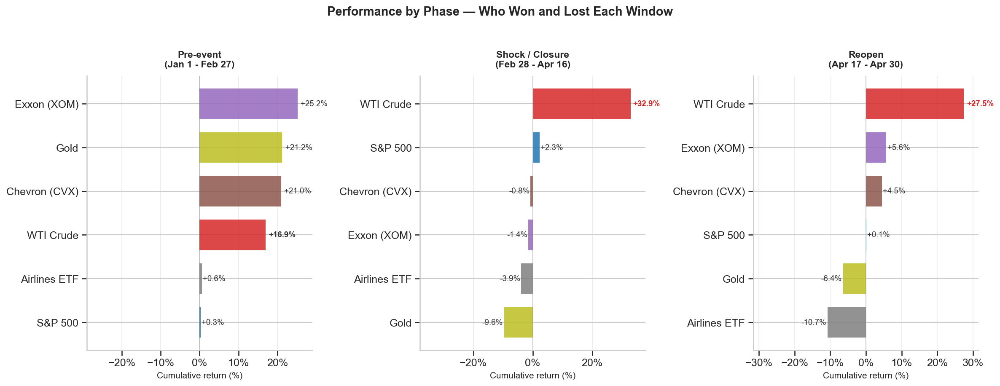

*Each panel isolates one phase. The shock column is the story: WTI positive, everything else negative or flat. Visualizing by phase makes the regime structure impossible to miss.*

The VIX peaked at **31.0** on March 27 — 1.5× its five-year average of 20.7.

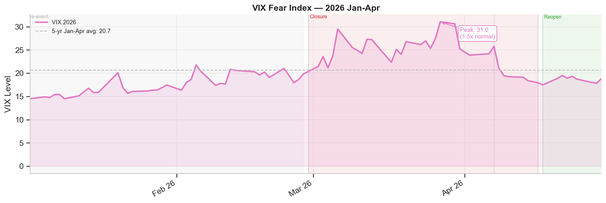

*VIX exceeded 80 in March 2020. It hit 40 in 2008. At 31, the Hormuz closure was elevated discomfort — not panic. The commodity chaos did not translate into financial system stress.*

What the market was saying: *this is a commodity problem, not a systemic one.* It was right.

---

## Act II.5: The Speed of Transmission

The market didn't price this gradually. Within five trading days of February 28, WTI was up **+33%**. XOM was negative.

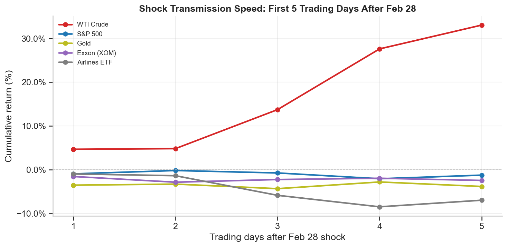

*WTI front-ran the narrative. XOM lagged and fell. By day 4, the decoupling was already established.*

| Days | CVX | Gold | JETS | S&P 500 | VIX | WTI | XOM |
| --- | --- | --- | --- | --- | --- | --- | --- |
| 1 | -0.4% | -3.5% | -1.0% | -0.9% | +9.9% | +4.7% | -1.6% |
| 2 | -1.9% | -3.3% | -1.4% | -0.2% | -1.4% | +4.8% | -2.8% |
| 3 | +0.2% | -4.3% | -5.8% | -0.7% | +10.8% | +13.7% | -2.2% |
| 4 | +0.2% | -2.8% | -8.5% | -2.1% | +37.6% | **+27.6%** | -2.0% |
| 5 | -0.1% | -3.8% | -7.0% | -1.2% | +18.9% | **+33.0%** | -2.4% |
*WTI was up +33% within 5 days. XOM was negative. The decoupling was immediate.*

*WTI was up +33% within 5 days. XOM was negative. The decoupling was immediate, not something that developed over weeks.*

The first-day reaction on February 28 tells the same story more sharply:

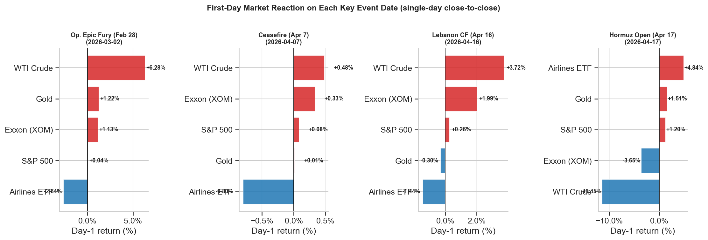

*Four events, five assets. WTI led on every single one. On the reopening announcement (Apr 17), WTI fell −11.5% while the S&P rose +1.2%. The futures market had already moved overnight.*

| asset | Apr 17 | Feb 28 |
| --- | --- | --- |
| Gold | +1.5% | +1.2% |
| JETS | +4.8% | -2.6% |
| S&P 500 | +1.2% | +0.0% |
| WTI | **-11.4%** | +6.3% |
| XOM | -3.6% | +1.1% |
*WTI -11.5% on Apr 17. S&P +1.2%. The futures market led the equity open by hours.*

---

## Act III: The Decoupling — The Central Finding

Here is the number the entire analysis builds toward.

> *Long WTI, short XOM returned **+34.4%** in 33 trading days during the closure window.*

That trade works only if the two assets — physical crude and the company that produces it — move in opposite directions during the shock. Which is exactly what happened.

XOM fell **−1.5%** while WTI rose **+32.9%**. These are not rounding errors. They are the same 33-day window. Energy equities didn't behave as commodity proxies. They behaved as risk assets — and got sold with everything else when equity sentiment deteriorated.

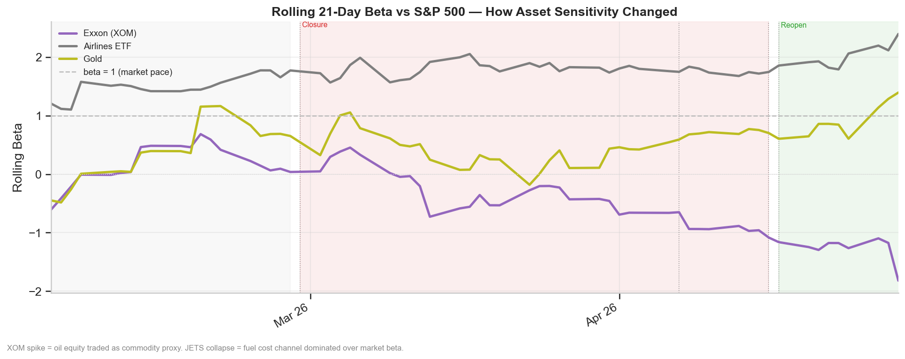

*XOM's beta flipped from +0.15 (neutral pre-event) to −0.42 (inverse during shock). The stock moved against the market — and against the commodity it produces.*

| Asset | Pre-event | Shock | Reopen |
| --- | --- | --- | --- |
| Exxon (XOM) | 0.16 | **-0.42** | -1.27 |
| Airlines (JETS) | 1.50 | **1.79** | 2.01 |
| Gold | 0.39 | **0.46** | 0.92 |
*Rolling 21-day OLS beta vs S&P 500. XOM flipped from near-zero to negative during the shock — the defining regime shift of the decoupling.*

The mechanism: during the shock, equity market sentiment drove XOM, not oil prices. When the S&P fell, XOM fell. When WTI rose, XOM didn't follow. The beta flip persisted for the entire 33-day closure window.

> *The market treated energy equities and physical oil as fundamentally different exposures during the 47-day closure. One rose 33%. The other fell. They were not the same trade.*

The **abnormal return decomposition** confirms this more precisely. Using OLS estimated on the pre-event window, we separate the market's contribution from the shock-specific component:

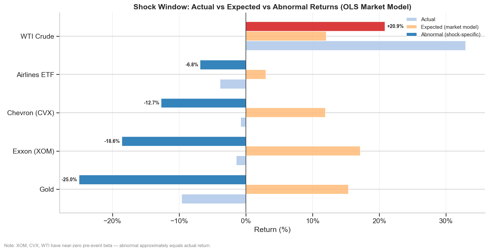

*The orange bar is what the market model predicted. The red bar is what actually happened. The gap is the Hormuz effect. WTI's gap is large and positive. Gold's and XOM's are large and negative.*

| Asset | Actual | Expected (beta) | Abnormal | Pre-event β |
| --- | --- | --- | --- | --- |
| WTI Crude | +32.9% | +12.1% | **+20.9%** | -0.03 |
| Gold | -9.6% | +15.4% | **-25.0%** | 0.29 |
| Exxon (XOM) | -1.4% | +17.1% | **-18.6%** | -0.02 |
| Chevron (CVX) | -0.8% | +11.9% | **-12.7%** | 0.02 |
| Airlines (JETS) | -3.9% | +3.0% | **-6.8%** | 1.56 |
*Abnormal = actual minus expected (OLS market model, pre-event beta). WTI's +20.9% is the pure Hormuz effect. Gold's −25.0% is the margin-call signature — it dramatically underperformed even its own model.*

WTI's **+20.9% abnormal return** is the pure Hormuz effect — what the closure added on top of what the market and historical trend would have predicted. XOM's **−18.6% abnormal return** means the stock dramatically underperformed even what its near-zero beta would have suggested.

---

## Act III.5: The Correlation Flip

Before the closure, WTI and the S&P 500 were statistically uncorrelated. A correlation of 0.00 is the normal structural relationship between crude oil prices and equity returns over short windows.

During the closure, that correlation flipped to **−0.58**.

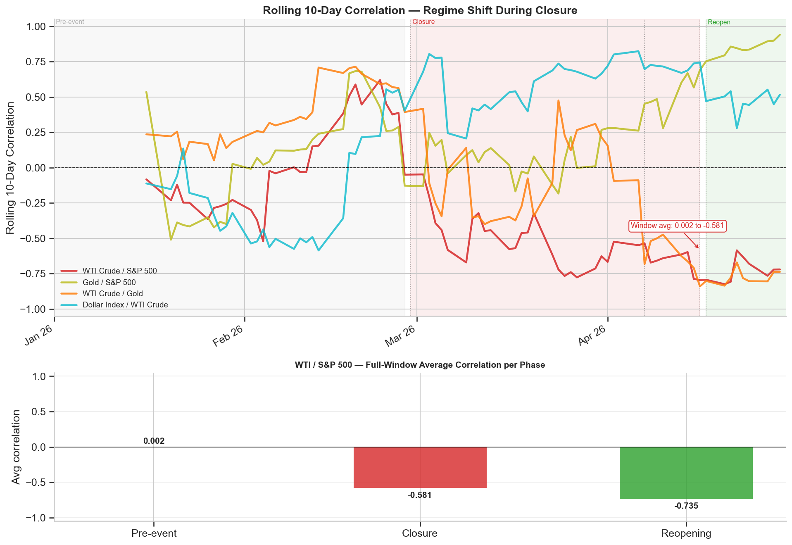

*The moment the blockade began, WTI and the S&P 500 became inverse. Oil rising meant equities falling. Oil falling meant equities recovering. The commodity stopped being independent — it became the primary driver of portfolio risk.*

| pair | pre_event | reopen | shock |
| --- | --- | --- | --- |
| DXY / SP500 | 0.022 | -0.575 | **-0.592** |
| DXY / WTI | -0.245 | 0.508 | **0.599** |
| GOLD / SP500 | 0.099 | 0.940 | **0.317** |
| WTI / GOLD | 0.317 | -0.755 | **-0.214** |
| WTI / SP500 | 0.002 | -0.735 | **-0.581** |
*DXY/WTI flipped from -0.24 to +0.60 — the supply shock signature. WTI/SPX from 0.00 to -0.58.*

The DXY/WTI correlation shift is equally important. Normally, a stronger dollar pushes oil down (negative correlation, −0.24 pre-event). During the shock, they rose together (+0.60). This is the supply-shock signature: physical scarcity overrides the usual currency mechanics. Oil goes up not because the dollar is weak, but because there aren't enough barrels.

Being "long oil" during the closure was not a diversifying position. It was an amplifier of total portfolio risk. Every standard mixed-asset portfolio that held WTI as a hedge absorbed more volatility, not less.

---

## Act IV: The False Dawn

On April 7, a temporary ceasefire was announced. On April 17, Iran declared the Strait of Hormuz open to commercial shipping.

WTI fell **−11.5%** on April 17. The S&P 500 rose **+1.2%**. The market priced the resolution in one trading day.

Then Iran re-closed the strait on April 18.

The "reopening window" (April 17–30) is better understood as a market response to an announcement than a verified normalization. WTI added another **+27.5%** during those nine days — markets were not convinced the opening would hold. They were right.

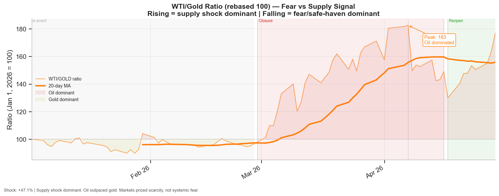

*Rising ratio = oil outpacing gold = supply shock dominant. The ratio peaked exactly on April 7 — the ceasefire announcement — then began to unwind as resolution approached.*

| Window | WTI | Gold | WTI/Gold Δ | Signal |
| --- | --- | --- | --- | --- |
| Pre-event | +16.9% | +21.2% | -4.3% | Fear / safe-haven |
| Shock (33d) | +32.9% | -9.6% | **+42.5%** | Supply shock dominant |
| Reopen (9d) | +27.5% | -6.4% | +33.9% | Mixed |
*Rising WTI/Gold ratio = markets pricing physical scarcity, not systemic fear. A +47pp gap during the shock is the single cleanest regime signal in the dataset.*

The WTI/Gold ratio rose **+47%** during the closure window. This is the cleanest signal in the entire dataset for distinguishing what kind of crisis this was.

In a financial crisis — 2008, 2020 — gold outpaces oil. Capital flees to safety. The ratio falls.

In a supply shock — 2022 Russia-Ukraine, 2026 Hormuz — oil outpaces gold. Markets price physical scarcity. The ratio rises.

The ratio peaked on April 7 (ceasefire) and began to fall. That peak is the market's real-time judgment that the acute supply shock phase was ending — before the official reopening announcement, before the equity market caught up.

For the next supply shock: **watch this ratio, not VIX.**

---

## What Broke

Three assets failed to do what conventional wisdom said they would.

**Gold: the safe haven that sold off.**

Gold dropped **−9.6%** during the 33-day closure after rallying **+21.2%** pre-event. In the first five days of the shock, it fell **−2.8%**. The pattern is consistent with forced liquidation — institutions selling their most liquid profitable position to cover equity margin calls. The safety net became the emergency exit.

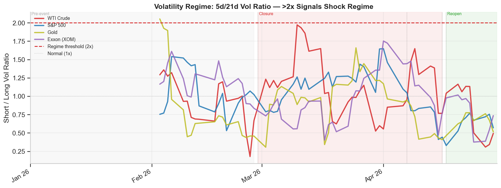

*Gold's volatility ratio exceeded 2.05× — the only asset to breach the hard threshold. WTI's ratio reached 1.97 (just below the threshold, but above the 90th historical percentile). The spike in Gold vol is the forced-selling signature.*

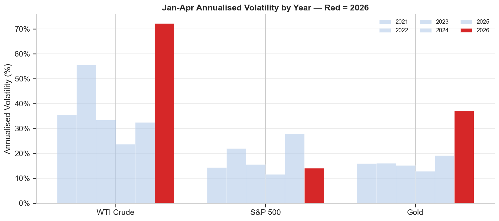

*WTI's 2026 vol (red bar) dwarfs every prior year. Gold's 2026 vol nearly doubled its historical average. The S&P stayed below its own historical average.*

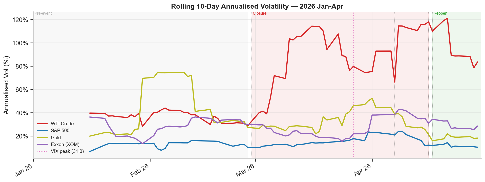

*WTI's rolling vol hit 98% annualized during the shock. The S&P 500 stayed below 20%. Commodity chaos with contained financial stress — that separation is the defining feature of a supply shock.*

**Energy equities: the oil proxy that wasn't.**

The equal-weight energy basket (XOM, CVX, WTI) suffered a **−12.3% maximum drawdown** during closure — **4.5 percentage points deeper** than the S&P 500's −7.8%.

*The energy hedge amplified losses. An investor who bought energy stocks as an oil hedge underperformed the market they were trying to hedge against.*

**Airlines: demand destruction outlasted the fuel cost shock.**

JETS fell **−3.9%** during the closure and then **−10.7%** during the reopening window — after oil had already dropped 11.5%. Lower fuel prices should help airlines. They didn't. The damage from prolonged high fuel costs isn't just the cost itself — it's route cancellations, reduced forward bookings, and recession fears baked into demand. When oil fell, the fuel cost relief arrived. The demand destruction was already done.

---

## What the Dollar Said (And What It Didn't)

One alternative explanation for WTI's surge: dollar weakness. Oil is priced in USD. When the dollar falls, oil rises mechanically — even without any supply change. A reasonable question: how much of WTI's +32.9% was real supply shock, and how much was currency?

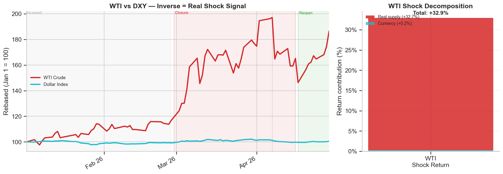

*The bar on the left is the total WTI return. The narrow blue strip at the bottom is the currency contribution. The rest is physical supply disruption.*

The DXY moved **−0.2%** during the closure. At a pre-event beta of −1.4 (oil on dollar), that produces a currency contribution of roughly **+0.2 percentage points**. Of WTI's +32.9% shock return, **less than 1%** is explained by dollar weakness.

This was not a currency trade. It was physical scarcity pricing.

The practical implication: during a confirmed supply shock, dollar technicals are noise. The correlation between DXY and WTI flipped from −0.24 (normal) to +0.60 (shock). The standard inverse relationship broke down because both were responding to the same physical constraint, not to each other.

---

## What Held

**The S&P 500** returned **+4.0%** January through April, with lower realized volatility than its historical average (14.1% vs. 18.2%). The modern US equity market has roughly 4% energy sector weight. The shock never became a credit event. The financial transmission channels stayed intact.

**The dollar** moved less than −0.2% during the closure. Capital flight into Treasuries kept the dollar bid. But it also didn't amplify the WTI move — the crude surge was real, not currency-inflated.

**WTI futures pricing** proved to be the leading indicator throughout. WTI trades 24 hours a day, five days a week. Every geopolitical development — every ceasefire rumor, every reopening announcement, every Iranian escalation — was priced in oil overnight before equity markets opened. The NYSE cash open confirmed what futures had already told you.

The lead-lag structure confirms this:

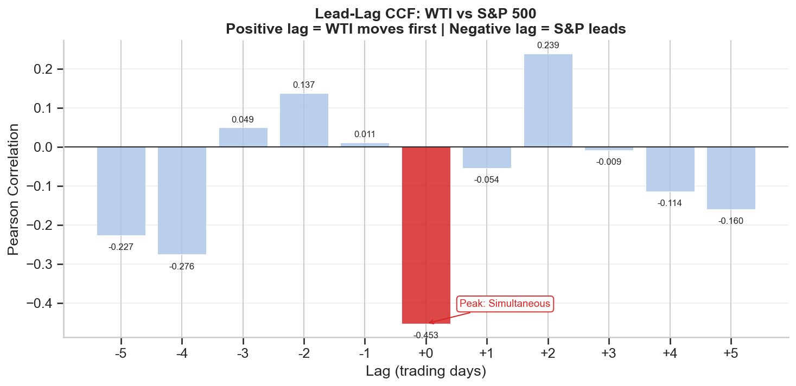

*Peak correlation at lag 0. No multi-day predictive relationship at the daily frequency. WTI and the S&P 500 moved simultaneously — because WTI had already moved overnight before the equity open.*

| lag | correlation |
| --- | --- |
| -5 | -0.227 |
| -4 | -0.276 |
| -3 | 0.049 |
| -2 | 0.137 |
| -1 | 0.011 |
| 0 | **-0.453** |
| 1 | -0.054 |
| 2 | 0.239 |
| 3 | -0.009 |
| 4 | -0.114 |
| 5 | -0.16 |
*Positive lag = WTI moves first. Peak at lag 0 (−0.45) — no exploitable daily lead-lag.*

*Peak at lag 0 (−0.45). No adjacent lag materially higher. At daily frequency, there is no exploitable lead-lag. Information moved too fast.*

---

## The Oil Import Penalty

The shock transmission was not uniform across geographies. Countries that import most of their oil absorbed significantly larger drawdowns.

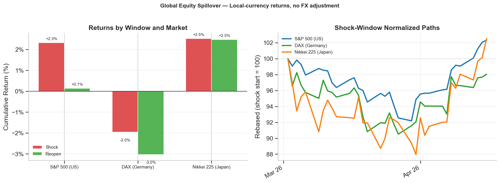

*The Nikkei's drawdown was nearly 60% deeper than the S&P's. Japan imports ~90% of its oil. Germany's industrial structure made the DAX the only index with a negative shock-window return.*

| Market | reopen | shock |
| --- | --- | --- |
| DAX (Germany) | -3.0% (DD: -3.0%) | -2.0% (DD: -9.5%) |
| Nikkei 225 | +2.5% (DD: -1.0%) | +2.5% (DD: -12.0%) |
| S&P 500 | +0.1% (DD: -0.9%) | +2.3% (DD: -7.8%) |
*Nikkei's +2.5% return masked a -12.1% drawdown. Oil importers suffered asymmetric stress.*

Japan imports approximately 90% of its oil consumption. The Nikkei's maximum drawdown during the closure reached **−12.1%** — 4.3 percentage points deeper than the S&P 500's −7.8%.

The DAX returned **−2.0%** during the shock window — the only negative cumulative return among the three indices studied. Germany's industrial concentration (autos, chemicals, manufacturing) created direct margin pressure from higher energy input costs.

The S&P 500's resilience reflects its structure: low energy sector weight, net exporter status, and the shock remaining a commodity event rather than a credit event.

For USD-based investors holding international equity: the Nikkei's +2.5% local return masked a **−12.1% drawdown**. The return headline was not the risk.

---

## The Pair Trade That Worked

The decoupling between physical oil and energy equities was not just a finding. It was a trade.

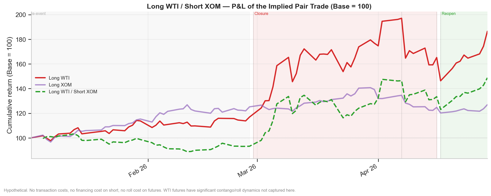

*The green dashed line is the pair trade. It diverged sharply at the Feb 28 shock onset and never converged back during the study window.*

| Window | Long WTI | Short XOM | Combined |
|--------|----------|-----------|----------|
| Pre-event | +16.9% | −25.2% | −8.2% |
| **Shock (33d)** | **+32.9%** | **+1.5%** | **+34.4%** |
| Reopen (9d) | +27.5% | −5.6% | +21.8% |

*Pre-event entry was costly — XOM rallied hard before the blockade. The trade only worked once the shock was confirmed and the decoupling became structural.*

The pre-event loss (−8.2%) is important context. Going in too early, before the WTI/Gold ratio confirmed the supply shock regime, was expensive. The trade rewarded those who waited for regime confirmation, not those who anticipated it speculatively.

**Caveat, non-negotiable:** these returns assume zero borrow costs, no futures roll, no slippage. Real-world execution costs reduce the P&L materially. This is a directional finding, not a trade recommendation.

---

## The Full Picture

The heatmap is the single-table summary of the entire study. Each cell is the cumulative return for one asset in one phase. Read across a row to see an asset's full arc. Read down a column to see who won and lost each regime.

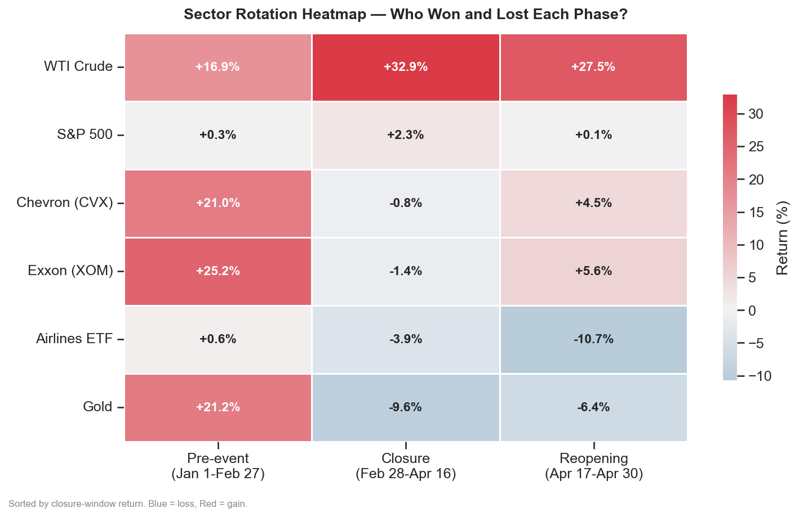

*Blue = loss. Red/orange = gain. The shock column is the story. WTI alone is positive. Everything else is negative or flat.*

| Asset | Asset | Shock Return | Max Drawdown | Shock Vol | Apr 17 Day-1 |
| --- | --- | --- | --- | --- | --- |
| 0 | WTI Crude | +32.9% | -19.2% | +98.5% | -11.4% |
| 1 | S&P 500 | +2.3% | -7.8% | +17.5% | +1.2% |
| 2 | Gold | -9.6% | -17.4% | +34.0% | +1.5% |
| 3 | Exxon (XOM) | -1.4% | -13.1% | +29.2% | -3.6% |
| 4 | Chevron (CVX) | -0.8% | -12.4% | +27.7% | nan |
| 5 | Airlines (JETS) | -3.9% | -14.7% | +38.1% | +4.8% |
*Shock window = Feb 28–Apr 16. Max drawdown measured within the shock window.*

*Read across the WTI row: positive in every window, at every scale. Read across the Gold row: positive pre-event, then negative in both event windows. That reversal is the margin-call hypothesis in numbers.*

---

## What This Means for the Next Time

**1. Own the barrel, not the company.**
During a supply shock, energy equities track equity sentiment, not commodity prices. XOM's beta flipped to −0.42. The pair trade (long WTI, short XOM) returned +34.4% in 33 days. Next time, this is the trade — not a long-only energy equity allocation.

**2. Watch WTI/Gold, not VIX.**
VIX peaked at 31 — elevated but uninformative about the regime. The WTI/Gold ratio told you everything: rising ratio means supply shock, traditional safe havens fail. Falling ratio means fear is dominant, go back to gold. Know which crisis you're in before deploying any hedge.

**3. The reopening will be priced overnight.**
WTI futures lead. The equity open confirms. Don't wait for the NYSE to react to a ceasefire announcement — it will already have happened in crude. The S&P priced April 17 in one session. WTI priced it between midnight and 9:30 AM.

---

> **The 2026 Hormuz closure was one of the largest supply disruptions in recorded history. The financial system absorbed it. The playbook didn't.**

---

## Methodology

Three event windows define the study: pre-event (Jan 1–Feb 27, 39 trading days), shock/closure (Feb 28–Apr 16, 33 days), and reopening (Apr 17–Apr 30, 9 days). Betas and seasonal baselines are estimated on the pre-event window only.

Abnormal returns use a standard OLS market model — each asset regressed on S&P 500 returns over the pre-event window — to separate the shock-specific component from general market movement. The DXY decomposition applies the same framework to isolate currency effects from real supply disruption. Volatility regime detection uses a 5d/21d annualized volatility ratio. Rolling betas use a 21-day OLS window.

Data: yfinance (`auto_adjust=True`), 2016–2026, adjusted close. All figures nominal — no CPI adjustment.

Full equations and reproducibility are in the [main notebook](notebooks/01_hormuz_analysis_notebook.ipynb) Appendix (Part A).

---

## Limitations

**The pair trade is pre-cost.** +34.4% assumes zero borrow costs, no futures roll, no slippage. Directional finding, not a trade recommendation.

**The gold margin-call mechanism is a hypothesis.** The pattern fits. Position-level data would be required to confirm.

**Single event.** This describes 2026 specifically. Validate against other supply shocks before generalizing.

**Daily data only.** Intraday lead-lag is invisible. The CCF peak at lag 0 is structurally biased by WTI's 24h trading versus NYSE hours.

**Beta estimated on 39 days.** During extreme volatility, relationships go non-linear. Treat magnitudes as directional bounds.

**The "reopening" wasn't.** Iran re-closed April 18. The Apr 17–30 window captures a market response to an announcement — not verified normalization. The dual blockade continued through the April 30 study cutoff.

---

*Analysis: Abdallah A Khames · BODZZ · [@abdallah-bodzz](https://github.com/abdallah-bodzz) · Static snapshot as of April 30, 2026.*