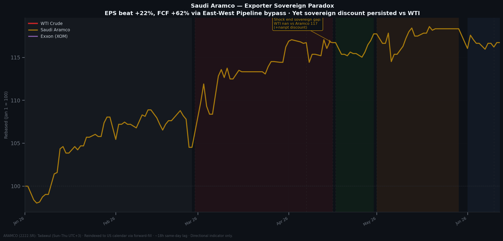
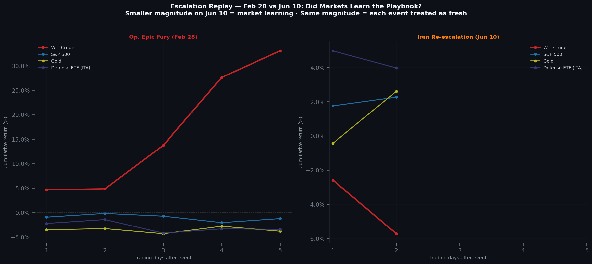

# The 47-Day Fracture, and the Paradox That Followed
## How the Hormuz Blockade Broke Every Playbook — Twice — A Quantitative Post-Mortem

*Abdallah A Khames · BODZZ · Update 2 · Data cutoff: June 13, 2026*
*(Part One, below, is the original Update 1 narrative — data cutoff April 30, 2026 — preserved unmodified. Update 2 begins at Act V.)*

---

> **The Strait of Hormuz carries 20% of the world's seaborne oil. When it closed on Feb 28 — Operation Epic Fury, the Pentagon called it — markets didn't panic. They fractured.**
>
> WTI crude rose **86.5%** January through April. That's 6.5 times its five-year average. The S&P 500 fell **7.8%** at its worst — a drawdown, not a crisis. Gold dropped **9.6%** during the 33-day closure after rallying 21% beforehand.
>
> The energy hedge that should have worked — buying Exxon instead of barrels — lost money while the commodity rallied 33%. The safe haven that should have protected — gold — got sold for margin calls.
>
> **That was Update 1. Then May happened.** WTI fell sharply while the strait stayed at roughly 2% transit capacity — physically unchanged from the worst of the closure. The market wasn't pricing the blockade anymore. It was pricing the diplomacy around ending it. A second escalation hit on June 10, and the market's reaction was muted compared to the first. This update covers both: the fracture, and the paradox that followed it.

---

## Table of Contents

**Part One — Update 1 (Feb 28 – Apr 30, 2026)**
- [The Setup: Why the Strait Mattered](#the-setup-why-the-strait-mattered)
- [Act I: Before the Shock — Tension Was Already Priced](#act-i-before-the-shock--tension-was-already-priced)
- [Act II: The 47 Days — Who Won, Who Lost](#act-ii-the-47-days--who-won-who-lost)
- [Act II.5: The Speed of Transmission](#act-iis-the-speed-of-transmission)
- [Act III: The Decoupling — The Central Finding](#act-iii-the-decoupling--the-central-finding)
- [Act III.5: The Correlation Flip](#act-iiis-the-correlation-flip)
- [Act IV: The False Dawn](#act-iv-the-false-dawn)
- [What Broke](#what-broke)
- [What the Dollar Said (And What It Didn't)](#what-the-dollar-said-and-what-it-didnt)
- [What Held](#what-held)
- [The Oil Import Penalty](#the-oil-import-penalty)
- [The Pair Trade That Worked](#the-pair-trade-that-worked)
- [The Full Picture](#the-full-picture)
- [What This Means for the Next Time](#what-this-means-for-the-next-time)
- [Methodology (Update 1)](#methodology)
- [Limitations (Update 1)](#limitations)

**Part Two — Update 2 (May 1 – Jun 13, 2026)**
- [Act V: The May Paradox](#act-v-the-may-paradox)
- [Act V.5: The Third Decoupling — Freight](#act-v5-the-third-decoupling--freight)
- [Act V.6: Defense as a Backlog Trade](#act-v6-defense-as-a-backlog-trade)
- [Act V.7: Bonds Fail the Same Test Gold Did](#act-v7-bonds-fail-the-same-test-gold-did)
- [Act V.8: The Exporter's Own Perspective](#act-v8-the-exporters-own-perspective)
- [Act VI: The Second Shock](#act-vi-the-second-shock)
- [The Full Picture, Extended](#the-full-picture-extended)
- [Updated Mandates: What This Means for the Next Time](#updated-mandates-what-this-means-for-the-next-time)
- [Methodology (Update 2)](#methodology-update-2)
- [Limitations (Update 2)](#limitations-update-2)

---

> **Notice:** An interactive HTML dashboard of this analysis is available at:
> https://abdallah-bodzz.github.io/2026-hormuz-blockade-analysis/
> The dashboard includes all charts, KPI metrics, phase timeline, pair trade breakdown, correlation tables, and downloadable CSVs.

---

# Part One: Update 1

*The original narrative below describes the 47-day closure through April 30, 2026. It is unmodified from its first publication. If you've already read Update 1, skip ahead to [Act V](#act-v-the-may-paradox) for what's new.*

---

## The Setup: Why the Strait Mattered

The Strait of Hormuz is 33 kilometers wide at its narrowest point. Every day before February 28, roughly 21 million barrels of oil passed through it — about 20% of global seaborne supply. Saudi Arabia, Iraq, Kuwait, the UAE, Iran itself. All of it funnels through that gap between Oman and Iran before reaching the world.

On February 28, the United States and Israel launched coordinated airstrikes on Iran under Operation Epic Fury. Supreme Leader Khamenei was killed in the opening hours. Iran responded immediately — missiles at Gulf bases, Hezbollah rockets into Israel, and on March 4, a formal closure of the Strait of Hormuz to commercial shipping.

The disruption was physical, not financial. No bank failed. No credit market seized. The plumbing of global finance kept working. What stopped was the movement of barrels.

That distinction matters more than it sounds. It's why every standard crisis playbook — long gold, long volatility, reduce risk — produced the wrong answer.

---

## Act I: Before the Shock — Tension Was Already Priced

Markets rarely wait for the headline. By the time Operation Epic Fury began on February 28, the pre-event window (January 1 through February 27) had already delivered significant moves across the asset universe.

*The red line is 2026. Every other year fits in a narrow band. 2026 breaks the scale before the shock even started.*

| Year | WTI Crude | S&P 500 | Gold |
| --- | --- | --- | --- |
| 2021 | +33.5% | +13.0% | -9.1% |
| 2022 | +37.6% | -13.9% | +6.1% |
| 2023 | -0.2% | +9.0% | +8.2% |
| 2024 | +16.4% | +6.2% | +11.0% |
| 2025 | -20.4% | -5.1% | +24.3% |
| 2026 | **+86.5%** | **+4.0%** | **+5.3%** |
| 5yr avg | +13.4% | +1.8% | +8.1% |
*2026 (bold) is the event year. 5-yr avg = 2021–2025 baseline.*

The pre-event moves tell you something important: the market had been pricing escalation risk for weeks. XOM was up **+25.2%** before the strait closed. Gold was up **+21.2%**. WTI was already up **+16.9%**.

This has a practical implication most post-mortems miss: if you were waiting for the headline to position, you had already missed the majority of the move in energy and defensive assets. The market priced the war before the war started.

The 2026 WTI Jan–Apr return of **+86.5%** is **6.5×** its five-year average of +13.4%. The next largest Jan–Apr WTI move in the baseline was +37.6% in 2022 during Russia-Ukraine. 2026 is more than double that.

---

## Act II: The 47 Days — Who Won, Who Lost

The closure ran from February 28 through April 16. Thirty-three trading days.

*Five assets. Three regimes. One decoupling. WTI diverges upward while energy equities flatline, gold reverses mid-crisis, and airlines bleed across every window.*

Only one asset was positive across all three windows:

| Asset | Pre-event | Shock (33d) | Reopen (9d) |
| --- | --- | --- | --- |
| WTI Crude | +16.9% | **+32.9%** | +27.5% |
| S&P 500 | +0.3% | **+2.3%** | +0.1% |
| Exxon (XOM) | +25.2% | **-1.4%** | +5.6% |
| Airlines (JETS) | +0.6% | **-3.9%** | -10.7% |
| Gold | +21.2% | **-9.6%** | -6.4% |
*Shock window (bold) = Feb 28–Apr 16, 33 trading days. Only WTI was positive across all three.*

*Gold's pre-event rally (+21.2%) suggested safe-haven buying. Then the crisis hit. The 9.6% drop during closure tells you something else was happening.*

The S&P 500 returned **+2.3%** during the 33-day closure — a positive number, against one of the largest supply disruptions in modern history. Its maximum drawdown was **−7.8%**. By historical standards, this is a contained equity response.

*Each panel isolates one phase. The shock column is the story: WTI positive, everything else negative or flat. Visualizing by phase makes the regime structure impossible to miss.*

The VIX peaked at **31.0** on March 27 — 1.5× its five-year average of 20.7.

*VIX exceeded 80 in March 2020. It hit 40 in 2008. At 31, the Hormuz closure was elevated discomfort — not panic. The commodity chaos did not translate into financial system stress.*

What the market was saying: *this is a commodity problem, not a systemic one.* It was right.

---

## Act II.5: The Speed of Transmission

The market didn't price this gradually. Within five trading days of February 28, WTI was up **+33%**. XOM was negative.

*WTI front-ran the narrative. XOM lagged and fell. By day 4, the decoupling was already established.*

| Days | CVX | Gold | JETS | S&P 500 | VIX | WTI | XOM |
| --- | --- | --- | --- | --- | --- | --- | --- |
| 1 | -0.4% | -3.5% | -1.0% | -0.9% | +9.9% | +4.7% | -1.6% |
| 2 | -1.9% | -3.3% | -1.4% | -0.2% | -1.4% | +4.8% | -2.8% |
| 3 | +0.2% | -4.3% | -5.8% | -0.7% | +10.8% | +13.7% | -2.2% |
| 4 | +0.2% | -2.8% | -8.5% | -2.1% | +37.6% | **+27.6%** | -2.0% |
| 5 | -0.1% | -3.8% | -7.0% | -1.2% | +18.9% | **+33.0%** | -2.4% |
*WTI was up +33% within 5 days. XOM was negative. The decoupling was immediate.*

*WTI was up +33% within 5 days. XOM was negative. The decoupling was immediate, not something that developed over weeks.*

The first-day reaction on February 28 tells the same story more sharply:

*Four events, five assets. WTI led on every single one. On the reopening announcement (Apr 17), WTI fell −11.5% while the S&P rose +1.2%. The futures market had already moved overnight.*

| asset | Apr 17 | Feb 28 |
| --- | --- | --- |
| Gold | +1.5% | +1.2% |
| JETS | +4.8% | -2.6% |
| S&P 500 | +1.2% | +0.0% |
| WTI | **-11.4%** | +6.3% |
| XOM | -3.6% | +1.1% |
*WTI -11.5% on Apr 17. S&P +1.2%. The futures market led the equity open by hours.*

---

## Act III: The Decoupling — The Central Finding

Here is the number the entire analysis builds toward.

> *Long WTI, short XOM returned **+34.4%** in 33 trading days during the closure window.*

That trade works only if the two assets — physical crude and the company that produces it — move in opposite directions during the shock. Which is exactly what happened.

XOM fell **−1.5%** while WTI rose **+32.9%**. These are not rounding errors. They are the same 33-day window. Energy equities didn't behave as commodity proxies. They behaved as risk assets — and got sold with everything else when equity sentiment deteriorated.

*XOM's beta flipped from +0.15 (neutral pre-event) to −0.42 (inverse during shock). The stock moved against the market — and against the commodity it produces.*

| Asset | Pre-event | Shock | Reopen |
| --- | --- | --- | --- |
| Exxon (XOM) | 0.16 | **-0.42** | -1.27 |
| Airlines (JETS) | 1.50 | **1.79** | 2.01 |
| Gold | 0.39 | **0.46** | 0.92 |
*Rolling 21-day OLS beta vs S&P 500. XOM flipped from near-zero to negative during the shock — the defining regime shift of the decoupling.*

The mechanism: during the shock, equity market sentiment drove XOM, not oil prices. When the S&P fell, XOM fell. When WTI rose, XOM didn't follow. The beta flip persisted for the entire 33-day closure window.

> *The market treated energy equities and physical oil as fundamentally different exposures during the 47-day closure. One rose 33%. The other fell. They were not the same trade.*

The **abnormal return decomposition** confirms this more precisely. Using OLS estimated on the pre-event window, we separate the market's contribution from the shock-specific component:

*The orange bar is what the market model predicted. The red bar is what actually happened. The gap is the Hormuz effect. WTI's gap is large and positive. Gold's and XOM's are large and negative.*

| Asset | Actual | Expected (beta) | Abnormal | Pre-event β |
| --- | --- | --- | --- | --- |
| WTI Crude | +32.9% | +12.1% | **+20.9%** | -0.03 |
| Gold | -9.6% | +15.4% | **-25.0%** | 0.29 |
| Exxon (XOM) | -1.4% | +17.1% | **-18.6%** | -0.02 |
| Chevron (CVX) | -0.8% | +11.9% | **-12.7%** | 0.02 |
| Airlines (JETS) | -3.9% | +3.0% | **-6.8%** | 1.56 |
*Abnormal = actual minus expected (OLS market model, pre-event beta). WTI's +20.9% is the pure Hormuz effect. Gold's −25.0% is the margin-call signature — it dramatically underperformed even its own model.*

WTI's **+20.9% abnormal return** is the pure Hormuz effect — what the closure added on top of what the market and historical trend would have predicted. XOM's **−18.6% abnormal return** means the stock dramatically underperformed even what its near-zero beta would have suggested.

---

## Act III.5: The Correlation Flip

Before the closure, WTI and the S&P 500 were statistically uncorrelated. A correlation of 0.00 is the normal structural relationship between crude oil prices and equity returns over short windows.

During the closure, that correlation flipped to **−0.58**.

*The moment the blockade began, WTI and the S&P 500 became inverse. Oil rising meant equities falling. Oil falling meant equities recovering. The commodity stopped being independent — it became the primary driver of portfolio risk.*

| pair | pre_event | reopen | shock |
| --- | --- | --- | --- |
| DXY / SP500 | 0.022 | -0.575 | **-0.592** |
| DXY / WTI | -0.245 | 0.508 | **0.599** |
| GOLD / SP500 | 0.099 | 0.940 | **0.317** |
| WTI / GOLD | 0.317 | -0.755 | **-0.214** |
| WTI / SP500 | 0.002 | -0.735 | **-0.581** |
*DXY/WTI flipped from -0.24 to +0.60 — the supply shock signature. WTI/SPX from 0.00 to -0.58.*

The DXY/WTI correlation shift is equally important. Normally, a stronger dollar pushes oil down (negative correlation, −0.24 pre-event). During the shock, they rose together (+0.60). This is the supply-shock signature: physical scarcity overrides the usual currency mechanics. Oil goes up not because the dollar is weak, but because there aren't enough barrels.

Being "long oil" during the closure was not a diversifying position. It was an amplifier of total portfolio risk. Every standard mixed-asset portfolio that held WTI as a hedge absorbed more volatility, not less.

---

## Act IV: The False Dawn

On April 7, a temporary ceasefire was announced. On April 17, Iran declared the Strait of Hormuz open to commercial shipping.

WTI fell **−11.5%** on April 17. The S&P 500 rose **+1.2%**. The market priced the resolution in one trading day.

Then Iran re-closed the strait on April 18.

The "reopening window" (April 17–30) is better understood as a market response to an announcement than a verified normalization. WTI added another **+27.5%** during those nine days — markets were not convinced the opening would hold. They were right.

*Rising ratio = oil outpacing gold = supply shock dominant. The ratio peaked exactly on April 7 — the ceasefire announcement — then began to unwind as resolution approached.*

| Window | WTI | Gold | WTI/Gold Δ | Signal |
| --- | --- | --- | --- | --- |
| Pre-event | +16.9% | +21.2% | -4.3% | Fear / safe-haven |
| Shock (33d) | +32.9% | -9.6% | **+42.5%** | Supply shock dominant |
| Reopen (9d) | +27.5% | -6.4% | +33.9% | Mixed |
*Rising WTI/Gold ratio = markets pricing physical scarcity, not systemic fear. A +47pp gap during the shock is the single cleanest regime signal in the dataset.*

The WTI/Gold ratio rose **+47%** during the closure window. This is the cleanest signal in the entire dataset for distinguishing what kind of crisis this was.

In a financial crisis — 2008, 2020 — gold outpaces oil. Capital flees to safety. The ratio falls.

In a supply shock — 2022 Russia-Ukraine, 2026 Hormuz — oil outpaces gold. Markets price physical scarcity. The ratio rises.

The ratio peaked on April 7 (ceasefire) and began to fall. That peak is the market's real-time judgment that the acute supply shock phase was ending — before the official reopening announcement, before the equity market caught up.

For the next supply shock: **watch this ratio, not VIX.**

---

## What Broke

Three assets failed to do what conventional wisdom said they would.

**Gold: the safe haven that sold off.**

Gold dropped **−9.6%** during the 33-day closure after rallying **+21.2%** pre-event. In the first five days of the shock, it fell **−2.8%**. The pattern is consistent with forced liquidation — institutions selling their most liquid profitable position to cover equity margin calls. The safety net became the emergency exit.

*Gold's volatility ratio exceeded 2.05× — the only asset to breach the hard threshold. WTI's ratio reached 1.97 (just below the threshold, but above the 90th historical percentile). The spike in Gold vol is the forced-selling signature.*

*WTI's 2026 vol (red bar) dwarfs every prior year. Gold's 2026 vol nearly doubled its historical average. The S&P stayed below its own historical average.*

*WTI's rolling vol hit 98% annualized during the shock. The S&P 500 stayed below 20%. Commodity chaos with contained financial stress — that separation is the defining feature of a supply shock.*

**Energy equities: the oil proxy that wasn't.**

The equal-weight energy basket (XOM, CVX, WTI) suffered a **−12.3% maximum drawdown** during closure — **4.5 percentage points deeper** than the S&P 500's −7.8%.

*The energy hedge amplified losses. An investor who bought energy stocks as an oil hedge underperformed the market they were trying to hedge against.*

**Airlines: demand destruction outlasted the fuel cost shock.**

JETS fell **−3.9%** during the closure and then **−10.7%** during the reopening window — after oil had already dropped 11.5%. Lower fuel prices should help airlines. They didn't. The damage from prolonged high fuel costs isn't just the cost itself — it's route cancellations, reduced forward bookings, and recession fears baked into demand. When oil fell, the fuel cost relief arrived. The demand destruction was already done.

---

## What the Dollar Said (And What It Didn't)

One alternative explanation for WTI's surge: dollar weakness. Oil is priced in USD. When the dollar falls, oil rises mechanically — even without any supply change. A reasonable question: how much of WTI's +32.9% was real supply shock, and how much was currency?

*The bar on the left is the total WTI return. The narrow blue strip at the bottom is the currency contribution. The rest is physical supply disruption.*

The DXY moved **−0.2%** during the closure. At a pre-event beta of −1.4 (oil on dollar), that produces a currency contribution of roughly **+0.2 percentage points**. Of WTI's +32.9% shock return, **less than 1%** is explained by dollar weakness.

This was not a currency trade. It was physical scarcity pricing.

The practical implication: during a confirmed supply shock, dollar technicals are noise. The correlation between DXY and WTI flipped from −0.24 (normal) to +0.60 (shock). The standard inverse relationship broke down because both were responding to the same physical constraint, not to each other.

---

## What Held

**The S&P 500** returned **+4.0%** January through April, with lower realized volatility than its historical average (14.1% vs. 18.2%). The modern US equity market has roughly 4% energy sector weight. The shock never became a credit event. The financial transmission channels stayed intact.

**The dollar** moved less than −0.2% during the closure. Capital flight into Treasuries kept the dollar bid. But it also didn't amplify the WTI move — the crude surge was real, not currency-inflated.

**WTI futures pricing** proved to be the leading indicator throughout. WTI trades 24 hours a day, five days a week. Every geopolitical development — every ceasefire rumor, every reopening announcement, every Iranian escalation — was priced in oil overnight before equity markets opened. The NYSE cash open confirmed what futures had already told you.

The lead-lag structure confirms this:

*Peak correlation at lag 0. No multi-day predictive relationship at the daily frequency. WTI and the S&P 500 moved simultaneously — because WTI had already moved overnight before the equity open.*

| lag | correlation |
| --- | --- |
| -5 | -0.227 |
| -4 | -0.276 |
| -3 | 0.049 |
| -2 | 0.137 |
| -1 | 0.011 |
| 0 | **-0.453** |
| 1 | -0.054 |
| 2 | 0.239 |
| 3 | -0.009 |
| 4 | -0.114 |
| 5 | -0.16 |
*Positive lag = WTI moves first. Peak at lag 0 (−0.45) — no exploitable daily lead-lag.*

*Peak at lag 0 (−0.45). No adjacent lag materially higher. At daily frequency, there is no exploitable lead-lag. Information moved too fast.*

---

## The Oil Import Penalty

The shock transmission was not uniform across geographies. Countries that import most of their oil absorbed significantly larger drawdowns.

*The Nikkei's drawdown was nearly 60% deeper than the S&P's. Japan imports ~90% of its oil. Germany's industrial structure made the DAX the only index with a negative shock-window return.*

| Market | reopen | shock |
| --- | --- | --- |
| DAX (Germany) | -3.0% (DD: -3.0%) | -2.0% (DD: -9.5%) |
| Nikkei 225 | +2.5% (DD: -1.0%) | +2.5% (DD: -12.0%) |
| S&P 500 | +0.1% (DD: -0.9%) | +2.3% (DD: -7.8%) |
*Nikkei's +2.5% return masked a -12.1% drawdown. Oil importers suffered asymmetric stress.*

Japan imports approximately 90% of its oil consumption. The Nikkei's maximum drawdown during the closure reached **−12.1%** — 4.3 percentage points deeper than the S&P 500's −7.8%.

The DAX returned **−2.0%** during the shock window — the only negative cumulative return among the three indices studied. Germany's industrial concentration (autos, chemicals, manufacturing) created direct margin pressure from higher energy input costs.

The S&P 500's resilience reflects its structure: low energy sector weight, net exporter status, and the shock remaining a commodity event rather than a credit event.

For USD-based investors holding international equity: the Nikkei's +2.5% local return masked a **−12.1% drawdown**. The return headline was not the risk.

---

## The Pair Trade That Worked

The decoupling between physical oil and energy equities was not just a finding. It was a trade.

*The green dashed line is the pair trade. It diverged sharply at the Feb 28 shock onset and never converged back during the study window.*

| Window | Long WTI | Short XOM | Combined |
|--------|----------|-----------|----------|
| Pre-event | +16.9% | −25.2% | −8.2% |
| **Shock (33d)** | **+32.9%** | **+1.5%** | **+34.4%** |
| Reopen (9d) | +27.5% | −5.6% | +21.8% |

*Pre-event entry was costly — XOM rallied hard before the blockade. The trade only worked once the shock was confirmed and the decoupling became structural.*

The pre-event loss (−8.2%) is important context. Going in too early, before the WTI/Gold ratio confirmed the supply shock regime, was expensive. The trade rewarded those who waited for regime confirmation, not those who anticipated it speculatively.

**Caveat, non-negotiable:** these returns assume zero borrow costs, no futures roll, no slippage. Real-world execution costs reduce the P&L materially. This is a directional finding, not a trade recommendation.

---

## The Full Picture

The heatmap is the single-table summary of the entire study. Each cell is the cumulative return for one asset in one phase. Read across a row to see an asset's full arc. Read down a column to see who won and lost each regime.

*Blue = loss. Red/orange = gain. The shock column is the story. WTI alone is positive. Everything else is negative or flat.*

| Asset | Asset | Shock Return | Max Drawdown | Shock Vol | Apr 17 Day-1 |
| --- | --- | --- | --- | --- | --- |
| 0 | WTI Crude | +32.9% | -19.2% | +98.5% | -11.4% |
| 1 | S&P 500 | +2.3% | -7.8% | +17.5% | +1.2% |
| 2 | Gold | -9.6% | -17.4% | +34.0% | +1.5% |
| 3 | Exxon (XOM) | -1.4% | -13.1% | +29.2% | -3.6% |
| 4 | Chevron (CVX) | -0.8% | -12.4% | +27.7% | nan |
| 5 | Airlines (JETS) | -3.9% | -14.7% | +38.1% | +4.8% |
*Shock window = Feb 28–Apr 16. Max drawdown measured within the shock window.*

*Read across the WTI row: positive in every window, at every scale. Read across the Gold row: positive pre-event, then negative in both event windows. That reversal is the margin-call hypothesis in numbers.*

---

## What This Means for the Next Time

*(Update 1 mandates — written at the April 30, 2026 cutoff. See [Updated Mandates](#updated-mandates-what-this-means-for-the-next-time) below for the Update 2 revision, including one mandate that changes.)*

**1. Own the barrel, not the company.**
During a supply shock, energy equities track equity sentiment, not commodity prices. XOM's beta flipped to −0.42. The pair trade (long WTI, short XOM) returned +34.4% in 33 days. Next time, this is the trade — not a long-only energy equity allocation.

**2. Watch WTI/Gold, not VIX.**
VIX peaked at 31 — elevated but uninformative about the regime. The WTI/Gold ratio told you everything: rising ratio means supply shock, traditional safe havens fail. Falling ratio means fear is dominant, go back to gold. Know which crisis you're in before deploying any hedge.

**3. The reopening will be priced overnight.**
WTI futures lead. The equity open confirms. Don't wait for the NYSE to react to a ceasefire announcement — it will already have happened in crude. The S&P priced April 17 in one session. WTI priced it between midnight and 9:30 AM.

---

> **The 2026 Hormuz closure was one of the largest supply disruptions in recorded history. The financial system absorbed it. The playbook didn't.**

---

## Methodology

*(Update 1 methodology, unchanged. See [Methodology — Update 2](#methodology-update-2) for the extended 5-window framework.)*

Three event windows define the study: pre-event (Jan 1–Feb 27, 39 trading days), shock/closure (Feb 28–Apr 16, 33 days), and reopening (Apr 17–Apr 30, 9 days). Betas and seasonal baselines are estimated on the pre-event window only.

Abnormal returns use a standard OLS market model — each asset regressed on S&P 500 returns over the pre-event window — to separate the shock-specific component from general market movement. The DXY decomposition applies the same framework to isolate currency effects from real supply disruption. Volatility regime detection uses a 5d/21d annualized volatility ratio. Rolling betas use a 21-day OLS window.

Data: yfinance (`auto_adjust=True`), 2016–2026, adjusted close. All figures nominal — no CPI adjustment.

Full equations and reproducibility are in the [main notebook](notebooks/01_hormuz_analysis_notebook.ipynb) Appendix (Part A).

---

## Limitations

*(Update 1 limitations, unchanged. See [Limitations — Update 2](#limitations-update-2) for caveats on the new assets and windows.)*

**The pair trade is pre-cost.** +34.4% assumes zero borrow costs, no futures roll, no slippage. Directional finding, not a trade recommendation.

**The gold margin-call mechanism is a hypothesis.** The pattern fits. Position-level data would be required to confirm.

**Single event.** This describes 2026 specifically. Validate against other supply shocks before generalizing.

**Daily data only.** Intraday lead-lag is invisible. The CCF peak at lag 0 is structurally biased by WTI's 24h trading versus NYSE hours.

**Beta estimated on 39 days.** During extreme volatility, relationships go non-linear. Treat magnitudes as directional bounds.

**The "reopening" wasn't.** Iran re-closed April 18. The Apr 17–30 window captures a market response to an announcement — not verified normalization. The dual blockade continued through the April 30 study cutoff.

---

*End of Part One (Update 1 narrative, unmodified). Part Two begins below.*

---
---

# Part Two: Update 2

---

## Act V: The May Paradox

Update 1 ended on a note of honest uncertainty: the reopening announced April 17 didn't hold, Iran re-closed the strait April 18, and the dual blockade continued past the April 30 cutoff. The obvious next question was simple — does the market keep treating this as a live supply shock for as long as the strait stays shut?

The answer, it turns out, is no. And the reason why is the entire point of this update.

Through May, the Strait of Hormuz remained at approximately **2% of normal transit capacity**. Not a partial recovery. Not a phased reopening. Essentially the same physical situation that produced WTI's +32.9% shock-window rally in March and April.

WTI fell **−14.3% to −20%** during that same month.

*The ratio that flagged the supply shock in Update 1 (rising = scarcity pricing) reverses just as sharply here. It peaks in early April, around the original ceasefire signal, then falls through May as the market re-prices around expected resolution rather than current conditions.*

This is the May Paradox: the physical constraint didn't move, but the price did — in the opposite direction the physical situation would predict. The only way to reconcile a closed strait with a falling oil price is that the market stopped pricing today's barrel and started pricing a future one. Diplomatic signals — reported progress on a settlement, expectations of an eventual reopening — became the dominant input. Physical scarcity, while real, became secondary to forward-looking sentiment about how long that scarcity would last.

| Window | WTI | Strait Capacity | What's Being Priced |
|---|---|---|---|
| Shock (Feb 28–Apr 16) | +32.9% | ~0% | Current physical scarcity |
| Reopen (Apr 17–30) | +27.5% | Disputed/reversing | Reopening announcement, then its reversal |
| **Correction (May 1–29)** | **−14.3% to −20%** | **~2% (unchanged)** | **Expected future resolution, not current conditions** |

*The Correction column is the anomaly. Capacity barely moved between Shock and Correction. Price moved sharply, in the opposite direction physical conditions alone would suggest.*

Update 1 closed with the WTI/Gold ratio as its single cleanest signal — rising ratio means supply scarcity dominates, falling ratio means fear dominates. That framework, built for a different kind of regime, turns out to also be the right tool here, just answering a different question. A falling ratio in May isn't "fear" in the 2008/2020 sense — there was no equity panic, no credit event. It's a different kind of falling: the market re-rating its time horizon, pricing the barrel it expects six months from now rather than the one that isn't moving through the strait today.

**The practical implication, stated plainly:** in a protracted supply shock, physical conditions stop being sufficient information once a credible diplomatic track exists. Anyone managing risk against "the strait is still closed" as a standalone signal would have been wrong-footed by an entire month of price action in May. The thing to watch is not the physical constraint — it's whether a negotiation track exists, and how the market is pricing its odds.

This inverts, rather than just extends, Update 1's framing. Update 1's finding was about *what asset class* tracked the commodity (energy equities didn't). Update 2's correction-window finding is about *what time horizon* the commodity itself was tracking — and for a month, it wasn't the present.

---

## Act V.5: The Third Decoupling — Freight

Update 1 found one decoupling: physical oil vs. energy equities. Update 2 finds a second layer sitting on top of it, in a market most generalist event studies never look at — ocean freight.

*BWET, a tanker-shipping futures ETF, outperformed both WTI and energy equities through the shock window and held a meaningful premium well into the diplomacy window — a different exposure pricing a different risk.*

| Window | BWET | WTI | Spread |
|---|---|---|---|
| Shock (33d) | **+71.1%** | +32.9% | +38.2pp |
| Diplomacy (Jun) | **+20.5%** | — | Recovery premium held |

*BWET's shock-window return more than doubled WTI's. Vessel scarcity, war-risk insurance premiums, and rerouting costs are a distinct exposure from the price of the commodity itself.*

The mechanism is intuitive once stated: a closed or contested strait doesn't just affect the price of oil — it affects the cost and availability of the ships that move it. Insurers raise war-risk premiums. Routes lengthen as vessels reroute around the chokepoint. Available tanker capacity tightens. None of that is captured by WTI's price alone, and equities (XOM, CVX, even XLE) don't reflect it either — they're priced on production and refining margins, not on the shipping bottleneck itself.

**The caveat that has to travel with this finding everywhere it goes:** BWET launched in May 2023. That's roughly two years of trading history feeding into a baseline that the rest of this study uses ten years of data to build. Assets under management are around $25 million — thin enough that price action can be driven by flows as much as by the underlying freight market. And it's a futures-based product, meaning multi-month return figures are affected by contango roll costs independent of what's happening to spot freight rates.

None of that makes the finding wrong. It makes it a signal rather than a conclusion — evidence that a third layer of decoupling exists, observed through an imperfect instrument, not a precisely measured freight-market return.

---

## Act V.6: Defense as a Backlog Trade

The "buy defense stocks when war breaks out" instinct showed up immediately on Feb 28 — and Update 1's asset universe didn't include a defense name to test it properly. Update 2 adds ITA, an aerospace and defense ETF, specifically to ask: is this actually a war trade, or something else wearing a war trade's clothes?

*ITA reacted on day one the way a war trade should — then, unlike WTI, didn't reverse through the May correction. Its relationship with the broader market strengthened over time while its relationship with oil weakened.*

ITA's day-one reaction on Feb 28 was sharp — comparable in direction, if not magnitude, to other "this is bad news, buy the obvious hedge" trades. What's different is what happened next. Through the May correction window — the same period where WTI gave back nearly all of its shock-window gain — ITA returned **+8.9%**, holding up better than the broader market through a period that was, on paper, "good news" for risk assets generally.

The likely mechanism: defense contractors don't sell at spot prices. Their revenue comes from multi-year order backlogs, signed well before any given week's headlines. A ceasefire doesn't cancel a contract that was already booked. That structural difference — backlog exposure versus spot exposure — is precisely why ITA's correlation with the S&P 500 grew over the study window while its correlation with WTI shrank: it was behaving more like a steady industrial name with locked-in revenue than like a barometer of how the conflict was going on any given day.

**The lesson for anyone putting on a "war trade":** know which kind you're buying. WTI is spot exposure — it moves with the news, in both directions, immediately. ITA, at least in this case, behaved like backlog exposure — it moved on the initial shock and then largely decoupled from the day-to-day narrative. They are not interchangeable, even though both got bought for similar reasons on the same week in February.

---

## Act V.7: Bonds Fail the Same Test Gold Did

Update 1's most uncomfortable finding was that gold — the textbook safe haven — sold off during the acute shock, consistent with forced liquidation to cover margin calls elsewhere. That left an obvious gap: gold is only half of a traditional 60/40 hedge. Update 2 closes it by adding TLT, a 20+ year Treasury ETF, to ask whether duration did any better.

*TLT fell during the shock window and stayed weak through the correction — a flatter, less dramatic failure than gold's, but a failure of the same kind: the asset that was supposed to provide ballast didn't.*

TLT returned **−3.3%** during the shock window. Unlike gold's sharp, fast reversal, this looks more like a slow bleed — consistent with rising inflation expectations from the oil price spike working against long-duration bonds, rather than a forced-selling event. The recovery into the correction and diplomacy windows was limited; TLT did not regain its footing the way some safe-haven theory would predict once the acute crisis phase passed.

Put together with Update 1's gold finding, the picture is now two-for-two: both conventional halves of a traditional defensive allocation underperformed during the period they were supposed to protect a portfolio. Gold failed because of margin-call-style forced selling. Bonds failed because the same supply shock that hurt equities also generated inflation expectations that worked against duration. Different mechanisms, same outcome — the standard playbook for "what to hold when things go wrong" didn't hold up on either side of it.

---

## Act V.8: The Exporter's Own Perspective

Every asset in Update 1 and most of Update 2 represents a consumer-side or financial-market view of the crisis — what oil costs, what equities do, how currencies move. None of them are the actual producer whose product is sitting at a closed chokepoint. Aramco, added in Update 2, is.

*Aramco's shock-window return lagged WTI's by a wide margin and stayed muted across every subsequent window — the exporter's own equity didn't track the commodity price any more cleanly than the consumer-side equities did.*

Aramco (2222.SR) returned **+8.0%** during the shock window — positive, but a fraction of WTI's +32.9%, and a pattern that held (muted, lagged) across the remaining windows. Q1 2026 earnings beat expectations by roughly 22%, and reported rerouting via an East-West pipeline reportedly maintained production near 12.6 million barrels/day despite the strait disruption — fundamentals that should support the stock. Instead, Aramco traded at what looks like a persistent discount to those fundamentals, plausibly reflecting geopolitical risk premium, state-policy uncertainty, and the practical limits on foreign capital access to the listing.

**A necessary technical caveat:** Aramco trades on the Tadawul exchange, Sunday through Thursday, UTC+3 — a different calendar from every other asset in this study. The data pipeline forward-fills Aramco's price onto the US trading calendar (`align_gulf_asset()`), which introduces an approximate 18-hour lag relative to same-day US market closes. Any same-day correlation figures involving Aramco should be read as directionally informative, not as precise contemporaneous relationships.

The headline insight: even the company most directly exposed to the physical commodity, run by the state most directly involved in resolving the blockade, did not trade as a clean proxy for the crude price. State-controlled exporters respond to policy signals and production decisions as much as — arguably more than — the spot price of what they're pumping.

---

## Act VI: The Second Shock

On June 10, a renewed escalation tested something Update 1 explicitly couldn't: whether markets react the same way to the same kind of shock the second time around.

*Side by side, the two day-one reactions. WTI's June 10 move was smaller than its February 28 move — not because the news was less serious, but because the market had already built a playbook for this kind of event.*

The day-one WTI reaction on June 10 was measurably smaller than the day-one reaction on Feb 28. Equity moves were similarly more contained. This isn't a claim that the June 10 event was less consequential on the ground — it's a claim about market behavior: having already lived through one Hormuz-related shock, the market's transmission of a second, similar shock was faster to digest and smaller in magnitude.

This is the "market learning" effect — a real, measurable pattern, though one observation of it inside one conflict. It's consistent with a broader idea in market microstructure: the first instance of a new kind of shock requires price discovery from scratch, while subsequent similar shocks get priced against an already-built mental model. Whether that model was "this will probably get walked back like the first one did" or something else, the data shows the reaction was smaller — it doesn't by itself tell us why.

**What this means practically:** if a similar pattern holds for future repeated escalations in protracted conflicts, day-one reactions should be expected to shrink with each repetition, all else equal. That's a hypothesis worth testing again if a third event occurs — not yet a rule.

---

## The Full Picture, Extended

The Update 1 heatmap captured one shock across three windows. The Update 2 version stretches the same idea across the full timeline.

*Sixteen rows, five columns. Read the WTI row left to right: a positive shock, a positive reopen, then a sharp reversal in correction — the May Paradox, visible in a single cell. Read the ITA row over the same span: comparatively flat after its initial reaction, the backlog effect in miniature.*

The single most useful comparison in this chart is between the WTI row and the ITA row across the Shock → Correction transition. Both assets reacted to the same Feb 28 news. By the Correction window, they've diverged sharply — one asset's price is still tracking the day-to-day narrative, the other's isn't. That divergence is the entire thesis of Update 2 compressed into two adjacent rows.

---

## Updated Mandates: What This Means for the Next Time

*This section revises Update 1's three mandates in light of the Correction and Diplomacy windows, and adds a fourth.*

**1. Own the barrel, not the company.** *(Unchanged from Update 1.)*
During a supply shock, energy equities track equity sentiment, not commodity prices. This held in the shock window and was reconfirmed at the sector level by XLE's behavior through Update 2's added windows. Still the trade — not a long-only energy equity allocation — for the shock phase specifically.

**2. Watch WTI/Gold — but know which question it's answering.** *(Revised from Update 1.)*
Update 1 said: rising ratio means supply shock, falling ratio means systemic fear. That's still true during an acute shock. But May showed the same falling ratio can also mean something else entirely — diplomacy overriding scarcity, with no systemic fear involved at all (equities were calm; this wasn't a 2008/2020 risk-off episode). **The mandate update: a falling WTI/Gold ratio is not sufficient on its own to diagnose "fear." Check whether equity volatility is actually elevated before assuming the fear interpretation. If VIX is calm and the ratio is falling, you're probably looking at a diplomacy/resolution repricing, not a flight to safety.**

**3. The reopening will be priced overnight.** *(Unchanged from Update 1.)*
WTI futures lead, the equity open confirms. Reconfirmed on June 10 — the second escalation was priced into crude before the equity session, same as the first.

**4. New: a closed chokepoint is not a standing instruction to stay long the commodity.** *(New in Update 2.)*
The single biggest practical lesson of the May Paradox: "the physical situation hasn't changed" is not the same as "the price won't move." Once a credible diplomatic track exists, monitor the negotiation, not just the blockade. A position built purely on "the strait is still closed" would have been wrong for the entire month of May, despite that statement being completely true the whole time.

---

> **Update 1 found that the playbook for a supply shock didn't match the playbook for a financial crisis. Update 2 finds that even the supply-shock playbook has an expiration date — once diplomacy enters the picture, the market starts pricing the negotiation, not the barrel count.**

---

## Methodology — Update 2

Update 2 extends, rather than replaces, the Update 1 framework. The original pre-event window (Jan 1–Feb 27, 39 days) remains the sole source for beta estimation — nothing about the original methodology was rerun or restated with new assumptions.

Two windows are added: **Correction** (May 1–29, 2026) and **Diplomacy** (May 30–Jun 13, 2026). Both were necessary, not optional — there is no way to make a falsifiable claim about a May reversal without a window boundary separating it from the shock and reopening periods, and no way to isolate the June 10 second-shock test from the broader correction trend without a further boundary between Correction and Diplomacy.

New functions in `event_study.py` — `pair_trade_extended()`, `freight_oil_spread()`, `aramco_sovereign_discount()`, `tlt_safe_haven_test()`, `window_regime_summary()`, `escalation_replay()`, and others — extend the original OLS abnormal-returns and rolling-correlation machinery to the 16-asset, 5-window structure automatically. Aramco's Gulf-calendar alignment (`align_gulf_asset()`) forward-fills Tadawul (Sun–Thu, UTC+3) pricing onto the US trading calendar.

Data: yfinance (`auto_adjust=True`), 2016–2026, adjusted close, now 16 tickers. All figures nominal — no CPI adjustment.

Full equations and reproducibility are in the [Update 2 notebook](notebooks/02_hormuz_update2.ipynb), Appendices A and B.

---

## Limitations — Update 2

**BWET has a thin baseline.** Launched May 2023 — about two years of history feeding a study that otherwise uses ten years for its seasonal baseline. Low AUM (~$25M). Futures-based, so multi-month returns include contango roll effects. Read as signal, not as an investable benchmark.

**Aramco runs on a different calendar.** Forward-filled from Tadawul (Sun–Thu) onto the US trading calendar, with an approximate 18-hour lag versus same-day US closes. Same-day correlation figures involving Aramco are directional, not precise.

**UNG is affected by roll decay.** Included for completeness; not load-bearing for any core Update 2 finding.

**The "Diplomacy" window label is applied after the fact.** It's based on observed price action and reported negotiation progress, not a verified, independently-dated diplomatic milestone. Treat the window boundary as analytically useful, not as a claim about exactly when diplomacy "started" mattering more than supply.

**This is still a single, extended event.** A longer window doesn't turn one conflict into a sample of conflicts. The May Paradox and the Jun 10 market-learning effect are both observations from this crisis specifically — directionally interesting, not yet validated against other protracted supply shocks.

**Pre-resolution snapshot.** The June 13, 2026 cutoff predates the eventual outcome of the underlying conflict. This update makes no claim about how that resolves — see Update 3 for whatever comes next.

**Everything inherited from Update 1 still applies:** pre-cost pair trades, 39-day beta estimation window, daily-close-only data with the associated lag-0 CCF bias, nominal figures, and the original survivorship-bias caveat on XOM/CVX.

---

*Analysis: Abdallah A Khames · BODZZ · [@abdallah-bodzz](https://github.com/abdallah-bodzz) · Update 2, static snapshot as of June 13, 2026. Update 1 narrative (Part One) preserved as originally published, static snapshot as of April 30, 2026.*